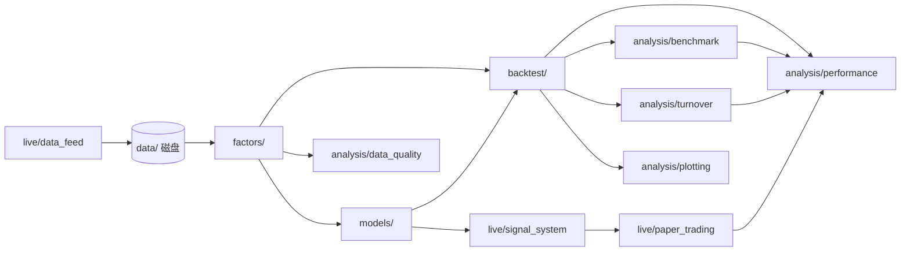

# 代码结构说明（Code Structure）

本文档说明仓库内**各目录与文件在整体流水线中的职责**：解决什么问题、与谁协作、实现时建议放在哪一层。  
**数据形态与函数入参出参**以 [INTERFACE_AND_CONTRACTS.md](./INTERFACE_AND_CONTRACTS.md) 为准；本文侧重「为什么有这一层」而不是字段级契约。

---

## 1. 整体设计思路

项目按**研究 → 回测 → 接近实盘**的顺序拆模块，目标是：

- **因子、回测、优化、数据源**可独立替换，减少「一个脚本里全写满」的耦合；
- **同一套数据结构**（尤其是长表面板）从因子一直贯通到绩效与作图；
- **配置集中**（路径、费率、区间），密钥不进仓库。

逻辑上的数据流可以概括为：

`main.py` 负责按你的研究习惯**串联**上述步骤；具体调用顺序不必与上图箭头一一相同（例如融合可能在回测内部每期调用）。

---

## 2. 根目录文件

| 文件 | 作用 |
|------|------|
| `config.py` | **全局参数**：项目根、`data/` 路径、默认价格列、手续费、再平衡频率、回测起止日、年化用交易日数等；`get_tushare_token()` 从环境变量读取 Token，避免写死在代码里。 |
| `main.py` | **MVP 程序入口**：拉数 → 四因子面板 → 数据质量报告 → 可选落盘 → IC → 可选 IC CSV 与图 → 四列单因子回测 → **IC 列权或等权**融合 → `run_multi_backtest` → 股票池等权基准与超额收益 → 换手率与预估成本 → 净值/超额净值/IC/权重/换手/覆盖率图。复杂逻辑在子包中实现。 |
| `requirements.txt` | **Python 依赖**列表，供虚拟环境一键安装。 |
| `README.md` | 快速开始、目录总览、文档索引。 |

---

## 3. `data/`：原始数据落盘

| 内容 | 作用 |
|------|------|
| 行情 CSV、财务 CSV 等 | **离线研究的单一事实来源**；与 `live/data_feed` 拉取后的列名对齐后，因子与回测应优先读这里，保证可复现。 |

约定哪些文件名、哪些列属于「契约」的一部分，见 `INTERFACE_AND_CONTRACTS.md` §2。  
当前仓库用 `.gitkeep` 占位；真实数据通常体积大，是否提交 Git 由你决定（可用 `.gitignore` 忽略 CSV）。

---

## 4. `factors/`：因子计算

| 文件 | 作用 |
|------|------|
| `__init__.py` | 导出各 `calc_*`，并维护 **`FACTOR_REGISTRY`**：用字符串名称（如 `"ROE"`）映射到计算函数，供单因子回测按名调用。 |
| `factor_momentum.py` | **动量类因子**（如过去 N 日收益）：输入以价格宽表为主，输出规范为长表 `PanelLong`。 |
| `factor_volatility.py` | **波动率因子**：基于收益宽表的滚动波动等，输出长表。 |
| `factor_pe.py` | **市盈率类因子**：需要行情与财报字段对齐，输出长表。 |
| `factor_roe.py` | **ROE 类因子**：依赖财务表与报告期/公告日规则，输出长表。 |

**本层不负责**仓位、手续费、优化；只负责「在合法信息集下算出每个 `(date, symbol)` 上的因子值」。  
新增因子时：新建模块实现 `calc_xxx`，并在 `FACTOR_REGISTRY` 注册名称。

---

## 5. `backtest/`：回测引擎与工具

| 文件 | 作用 |
|------|------|
| `backtest_utils.py` | **公共工具**：价格 ↔ 收益、长表 ↔ 宽表、因子与行情对齐等。避免在 `backtest_single` 与 `backtest_multi` 里重复写 pivot/stack、对齐索引。 |
| `backtest_single.py` | **单因子回测**：给定因子名（查注册表）或已算好的因子序列，执行分层/Top-K、再平衡、交易成本等，输出**净值序列**及可选元信息（换手、持仓）。 |
| `backtest_multi.py` | **多因子回测入口**：`run_multi_backtest(fused=...)` 将已融合的一列得分交给 `run_single_backtest`；或 `run_multi_backtest(factors, weights=...)` 先做**列线性加权**再回测。`main` 中融合路径使用前者。 |

**本层**是「策略逻辑 + 时间轴 + 约束」的核心实现处之一；`models` 产出的权重或得分通常在这里被消费。

---

## 6. `models/`：组合优化与多模型融合

| 文件 | 作用 |
|------|------|
| `optimizer.py` | **组合优化**：`maximize_sharpe`、`risk_parity`（numpy）；**`backtest_single` 在 `portfolio_weighting` 为 `max_sharpe` 或 `risk_parity` 时再平衡日调用对应函数**。 |
| `fusion.py` | **多因子融合**：`cross_sectional_zscore`、`fuse_equal_weight_zscore`、**`fuse_ic_weighted_zscore`（IC 滞后滚动列权）**；`fuse_models` 仅部分 `method`。 |

**本层**偏重「数学/优化问题」；日历、停牌、最小成交单位等**回测细节**仍建议在 `backtest` 或 `live` 处理。

---

## 7. `analysis/`：绩效与可视化

| 文件 | 作用 |
|------|------|
| `data_quality.py` | **数据质量与覆盖率**：统计价格覆盖率、因子覆盖率、每日覆盖率、调仓日有效截面规模。 |
| `performance.py` | **绩效指标**：由净值序列计算年化收益、波动、夏普、最大回撤等；与回测输出直接对接，便于统一口径。 |
| `benchmark.py` | **基准与超额收益**：构造股票池等权基准，计算超额收益、跟踪误差、信息比率，并生成超额净值宽表。 |
| `turnover.py` | **换手率与成本**：从 `meta["rebalance_log"]` 计算逐期换手、预估成本和汇总指标。 |
| `plotting.py` | **图表**：`plot_nav`、`plot_ic`、`plot_weights`、`plot_turnover`、`plot_factor_coverage`；`rebalance_log_to_weights_frame` 将 `meta["rebalance_log"]` 转为权重宽表。 |
| `ic.py` | **截面 IC**：日频 Spearman（因子 vs 前瞻收益）、汇总统计与可选 CSV 落盘；**不参与**回测调仓。 |

**本层**应尽量**无业务状态**：输入 Series/DataFrame，输出指标 dict 或保存图片，方便单元测试与脚本复用。

---

## 8. `live/`：数据接入、信号、模拟交易

| 文件 | 作用 |
|------|------|
| `data_feed.py` | **行情接入**：Tushare/AkShare 拉取或读本地 CSV，输出列名与契约对齐，供因子与回测使用。 |
| `cache_io.py` | **缓存与实验记录**：保存行情长表、收盘价宽表、因子面板、数据质量报告、运行配置、绩效汇总、调仓日志、换手日志等，形成可复现实验档案。 |
| `signal_system.py` | **信号生成**：将因子得分或融合结果变成离散买卖信号（或目标仓位），规则可与回测层对齐以减少「回测一套、实盘一套」。 |
| `paper_trading.py` | **模拟盘**：按信号与行情更新虚拟账户、记录成交；用于在接近实盘的流程下验证逻辑，**不等同**于已接入券商 API 的真实下单。 |

**本层**是「研究与生产之间的缓冲带」：接口稳定后，真实实盘可在同结构下替换撮合与下单实现。

---

## 9. `docs/`：设计文档

| 文件 | 作用 |
|------|------|
| `INTERFACE_AND_CONTRACTS.md` | **接口与数据契约**：长表索引、CSV 列、各函数输入输出约定、缺失值与 Token 约定。 |
| `CODE_STRUCTURE.md` | **本文档**：模块职责与协作关系，偏架构与导读。 |
| `ENGINEERING_OVERVIEW.md` | **工程总览**：端到端行为、公式级说明、与 `main` 步骤对齐。 |
| `FLOW_AND_MODULES.md` | **主流程图**（Mermaid）与逐步说明表。 |

---

## 10. 阅读与改代码的顺序建议

1. `config.py` → 路径、费率、`portfolio_weighting`、IC 与优化窗口等。  
2. `docs/FLOW_AND_MODULES.md` 或 `ENGINEERING_OVERVIEW.md` → 主流程。  
3. `factors/panel_builder.py` + `backtest/backtest_utils.py` → 面板与对齐。  
4. `backtest/backtest_single.py` → 单策略闭环（含 Top-K 与等权 / 夏普 / 风险平价）。  
5. `analysis/plotting.py` → `plot_nav` / `plot_ic` / `plot_weights` 与 `rebalance_log_to_weights_frame`。  
6. `backtest/backtest_multi.py` + `models/fusion.py` → 多因子接入回测。  
7. `analysis/ic.py`、`analysis/data_quality.py`、`analysis/performance.py`、`analysis/benchmark.py`、`analysis/turnover.py` → IC、数据质量、绩效、基准、超额收益、换手与成本。  
8. `live/` → 数据接入；信号与模拟盘占位。

**文档与代码**需人工同步；无 CI 自动 diff。改 `main` 或契约时请更新 `docs/` 与 `README.md`。
