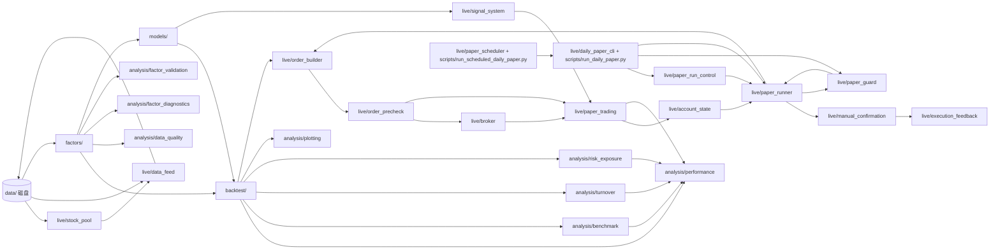

# 代码结构说明（Code Structure）

本文档说明仓库内**各目录与文件在整体流水线中的职责**：解决什么问题、与谁协作、实现时建议放在哪一层。  
**数据形态与函数入参出参**以 [INTERFACE_AND_CONTRACTS.md](./INTERFACE_AND_CONTRACTS.md) 为准；本文侧重「为什么有这一层」而不是字段级契约。

---

## 1. 整体设计思路

项目按**研究 → 回测 → 接近实盘**的顺序拆模块，目标是：

- **因子、回测、优化、数据源**可独立替换，减少「一个脚本里全写满」的耦合；
- **同一套数据结构**（尤其是长表面板）从因子一直贯通到绩效与作图；
- **配置集中**（路径、费率、区间），密钥不进仓库。

逻辑上的数据流可以概括为：

`main.py` 负责按你的研究习惯**串联**上述步骤；具体调用顺序不必与上图箭头一一相同（例如融合可能在回测内部每期调用）。

---

## 2. 根目录文件

| 文件 | 作用 |
|------|------|
| `config.py` | **全局参数**：项目根、`data/` 路径、股票池路径、Tushare 行情缓存路径、默认价格列、手续费、再平衡频率、回测起止日、单票/行业/波动率/最小持仓/换手约束、订单手数/最小订单金额/现金缓冲、纸面账户初始资金、年化用交易日数等；`get_tushare_token()` 从环境变量读取 Token，避免写死在代码里。 |
| `main.py` | **MVP 程序入口**：加载本地 demo / 行情缓存 / 股票池 Tushare 数据 → 多因子面板 → 数据质量报告 → 可选落盘 → IC 与稳定性诊断 → 因子诊断（Top-K 多头超额 + 分组收益单调性）→ 多因子权重建议 / 训练段权重 / 滚动权重日志 → 可选 IC CSV 与图 → 多列单因子回测（内部可做可交易性 / 流动性过滤与决策审计）→ **IC 列权或等权**融合 / **训练段静态综合权重**融合 / **调仓日前滚动综合权重**融合 → `run_multi_backtest`（同样复用过滤与审计）→ 股票池等权基准与超额收益 → 换手率与预估成本 → 风险暴露与集中度 → 净值/超额净值/IC/权重/换手/集中度/覆盖率图。复杂逻辑在子包中实现。 |
| `requirements.txt` | **Python 依赖**列表，供虚拟环境一键安装。 |
| `README.md` | 快速开始、目录总览、文档索引。 |

---

## 3. `data/`：原始数据落盘

| 内容 | 作用 |
|------|------|
| 股票池 Excel/CSV、行情缓存、财务 CSV 等 | **离线研究的单一事实来源**；股票池由 `live/stock_pool` 规范化为 Tushare 代码，行情与 `live/data_feed` 拉取后的列名对齐后，因子与回测应优先读这里，保证可复现。 |

约定哪些文件名、哪些列属于「契约」的一部分，见 `INTERFACE_AND_CONTRACTS.md` §2。  
当前仓库用 `.gitkeep` 占位；真实数据通常体积大且包含研究资产，默认 `.gitignore` 会忽略 `data/*.csv`、`data/*.xlsx`、`data/*.xls`。

---

## 4. `factors/`：因子计算

| 文件 | 作用 |
|------|------|
| `__init__.py` | 导出各 `calc_*`，并维护 **`FACTOR_REGISTRY`**：用字符串名称（如 `"ROE"`）映射到计算函数，供单因子回测按名调用。 |
| `factor_momentum.py` | **动量类因子**（如过去 N 日收益）：输入以价格宽表为主，输出规范为长表 `PanelLong`。 |
| `factor_reversal.py` | **短期反转因子**：过去 N 日收益取负，数值越大表示近期跌得越多。 |
| `factor_volume.py` | **成交量因子**：成交量相对过去窗口均量的放大程度。 |
| `factor_volatility.py` | **波动率因子**：基于收益宽表的滚动波动等，输出长表。 |
| `factor_pe.py` | **市盈率类因子**：需要行情与财报字段对齐，输出长表。 |
| `factor_roe.py` | **ROE 类因子**：依赖财务表与报告期/公告日规则，输出长表。 |
| `factor_finance.py` | **质量与成长类财务因子**：毛利率、净利率、低资产负债率、营收增长、利润增长；按公告日向后对齐，避免未来函数。 |
| `factor_ml.py` | **机器学习打分因子**：用已有因子面板滚动训练梯度提升类模型，预测未来收益并输出 `ML_SCORE`；只作为候选因子进入 IC、分组收益、样本外验证和回测。 |
| `preprocess.py` | **因子清洗与标准化**：按交易日横截面做 winsorize、z-score，供融合与缓存复用。 |

**本层不负责**仓位、手续费、优化；只负责「在合法信息集下算出每个 `(date, symbol)` 上的因子值」。  
新增因子时：新建模块实现 `calc_xxx`。若要支持 `run_single_backtest("NAME")` 自动重算，需要在 `FACTOR_REGISTRY` 注册；若像质量 / 成长财务因子一样依赖财务表与行情长表共同对齐，也可以先通过 `panel_builder` 统一生成，再由 `main` 以预计算 `factor_values` 传入回测。`ML_SCORE` 属于二阶因子：它依赖基础因子面板训练得到，因此在 `main` 中基础面板生成后追加。

---

## 5. `backtest/`：回测引擎与工具

| 文件 | 作用 |
|------|------|
| `backtest_utils.py` | **公共工具**：价格 ↔ 收益、长表 ↔ 宽表、因子与行情对齐等。避免在 `backtest_single` 与 `backtest_multi` 里重复写 pivot/stack、对齐索引。 |
| `backtest_single.py` | **单因子回测**：给定因子名（查注册表）或已算好的因子序列，执行分层/Top-K、Top-K 前可交易性 / 流动性过滤、停牌 / 涨跌停交易约束、再平衡、交易成本、单票权重上限、行业权重上限、波动率目标与现金仓位、最小持仓数量、单次换手上限等，输出**净值序列**及可选元信息（换手、持仓、过滤前后候选数、行业暴露、目标波动缩放、最小持仓检查、逐股票决策审计日志）。 |
| `backtest_multi.py` | **多因子回测入口**：`run_multi_backtest(fused=...)` 将已融合的一列得分交给 `run_single_backtest`；或 `run_multi_backtest(factors, weights=...)` 先做**列线性加权**再回测。`main` 中融合路径使用前者。 |

**本层**是「策略逻辑 + 时间轴 + 约束」的核心实现处之一；`models` 产出的权重或得分通常在这里被消费。

---

## 6. `models/`：组合优化与多模型融合

| 文件 | 作用 |
|------|------|
| `optimizer.py` | **组合优化**：`maximize_sharpe`、`risk_parity`（numpy）；**`backtest_single` 在 `portfolio_weighting` 为 `max_sharpe` 或 `risk_parity` 时再平衡日调用对应函数**。 |
| `fusion.py` | **多因子融合**：复用 `factors.preprocess.cross_sectional_zscore`，提供 `fuse_equal_weight_zscore`、**`fuse_ic_weighted_zscore`（IC 滞后滚动列权）**、**`fuse_static_weight_zscore`（训练段静态综合权重）**；`fuse_models` 仅部分 `method`。 |
| `factor_weighting.py` | **因子权重建议**：把 IC 分布、rolling IC、Top-Bottom 与单调性等评价指标合成 `factor_score` / `fusion_weight`；全样本用于诊断，训练段用于 `FUSED_SCORE_WEIGHTED`，调仓日前滚动窗口用于 `FUSED_ROLLING_SCORE_WEIGHTED`。 |

**本层**偏重「数学/优化问题」；日历、停牌、最小成交单位等**回测细节**仍建议在 `backtest` 或 `live` 处理。

---

## 7. `analysis/`：绩效与可视化

| 文件 | 作用 |
|------|------|
| `data_quality.py` | **数据质量与覆盖率**：统计价格覆盖率、因子覆盖率、每日覆盖率、调仓日有效截面规模。 |
| `performance.py` | **绩效指标**：由净值序列计算年化收益、波动、夏普、最大回撤等；与回测输出直接对接，便于统一口径。 |
| `benchmark.py` | **基准与超额收益**：构造股票池等权基准，计算超额收益、跟踪误差、信息比率，并生成超额净值宽表。 |
| `factor_diagnostics.py` | **因子诊断**：构造每个因子的 Top-K 等权多头腿，计算相对股票池等权基准的超额收益；同时计算分组收益、Top-Bottom 和单调性评分。 |
| `factor_validation.py` | **样本外验证与因子失效监控**：把 IC、多头超额、Top-Bottom 和单调性按训练段 / 验证段拆开比较，并输出 `OK/WATCH/DEGRADED/FAILED` 状态表。 |
| `turnover.py` | **换手率与成本**：从 `meta["rebalance_log"]` 计算逐期换手、预估成本和汇总指标。 |
| `risk_exposure.py` | **风险暴露与集中度**：从 `meta["rebalance_log"]` 计算 HHI、effective_n、Top 权重、持仓数和汇总指标。 |
| `plotting.py` | **图表**：`plot_nav`、`plot_ic`、`plot_weights`、`plot_turnover`、`plot_effective_n`、`plot_factor_coverage`；`rebalance_log_to_weights_frame` 将 `meta["rebalance_log"]` 转为权重宽表。 |
| `ic.py` | **截面 IC 与稳定性诊断**：日频 Spearman（因子 vs 前瞻收益）、基础汇总、分布分位数、正负占比、滚动稳定性与可选 CSV 落盘；**不参与**回测调仓。 |

**本层**应尽量**无业务状态**：输入 Series/DataFrame，输出指标 dict 或保存图片，方便单元测试与脚本复用。

---

## 8. `live/`：数据接入、信号、模拟交易

| 文件 | 作用 |
|------|------|
| `data_feed.py` | **行情接入**：Tushare/AkShare 拉取或读本地 CSV，输出列名与契约对齐，供因子与回测使用。 |
| `stock_pool.py` | **股票池管理与实盘目标池确认**：从 Excel/CSV 读取人工研究池，规范化 Tushare `ts_code`，保留简称、主题、子行业、启用状态；基于价格覆盖、最新价格、流动性和停牌 / 涨跌停状态生成过滤报告与 active universe。 |
| `cache_io.py` | **缓存与实验记录**：保存行情长表、收盘价宽表、因子面板、数据质量报告、因子诊断、训练段权重、滚动权重日志、运行配置、绩效汇总、调仓日志、换手日志、订单计划、订单预检查结果、纸面交易日志、集中度日志等，形成可复现实验档案。 |
| `account_state.py` | **纸面账户状态**：保存 / 读取虚拟账户现金、持仓和每日快照，让纸面交易可以跨天连续运行。 |
| `order_builder.py` | **订单生成**：把目标权重、当前持仓、现金 / 总资产和最新价格转换成 `BUY/SELL`、目标股数、调整股数、预估金额与交易原因。只生成订单计划，不连接券商、不模拟成交。 |
| `order_precheck.py` | **订单预检查**：检查订单计划的现金、可卖数量、买入手数、最小金额、停牌和涨跌停约束，输出 `PASS/BLOCK` 与原因。只做检查，不修改订单、不撮合成交。 |
| `broker.py` | **统一券商接口协议**：定义 `BrokerAdapter`、`BrokerAccount`、`BrokerPosition`、`BrokerOrder`、`SimulatedBroker` 与 `RealBrokerReadOnlyAdapter`，把查资金、查持仓、查订单、下单、撤单抽象成统一方法。模拟券商用于验证协议；真实券商先用只读 adapter 验证账户、持仓和订单读取。 |
| `broker_reconcile.py` | **纸面 / 真实账户只读对账**：比较纸面账户与只读券商账户的现金、总资产、持仓股数和可用股数差异，输出账户差异、持仓差异和 Markdown 对账报告。 |
| `signal_system.py` | **信号生成**：将因子得分或融合结果变成离散买卖信号（或目标仓位），规则可与回测层对齐以减少「回测一套、实盘一套」。 |
| `paper_trading.py` | **纸面交易**：按订单计划与预检查结果更新虚拟现金和持仓，记录 `FILLED/SKIPPED`、手续费、现金变化与持仓变化；用于在接近实盘的流程下验证逻辑，**不等同**于已接入券商 API 的真实下单。 |
| `paper_runner.py` | **每日纸面运行器**：读取纸面账户状态，串联订单生成、订单预检查、执行模式选择、成交回报兼容、持仓更新、账户快照和落盘；默认走旧纸面成交，也可通过 `simulated_broker` 走统一券商接口。 |
| `paper_report.py` | **纸面交易日报**：把单日纸面运行结果整理成 Markdown，包含运行摘要、执行模式、账户快照、订单、阻断原因、成交、券商订单回报、持仓和输出文件路径。 |
| `manual_confirmation.py` | **小资金人工确认实盘单**：基于订单计划、预检查和可选因子失效监控生成 CSV / Markdown 确认单，预留真实执行回填字段；只辅助人工下单，不自动连接券商。 |
| `execution_feedback.py` | **真实成交回填与执行偏差分析**：读取人工确认单中的真实成交回填字段，对比系统建议数量、价格、金额和实际执行结果，输出逐笔偏差、成交状态和汇总报告。 |
| `paper_guard.py` | **运行失败 / 异常检查**：在日终纸面运行前后检查目标权重、价格、日期、现金、持仓、订单检查和成交日志；ERROR 阻断，WARNING 进入摘要和日报。 |
| `paper_run_control.py` | **交易日日历 / 重复运行保护**：从价格缓存提取交易日日历，默认阻断非交易日运行；检查同日纸面账户快照，默认阻断重复覆盖。 |
| `paper_scheduler.py` | **每日调度封装**：运行一次日终纸面交易并记录 stdout、stderr、参数和退出码，供 cron / launchd / 服务器调度器调用。 |
| `daily_paper_cli.py` | **日终纸面交易辅助逻辑**：从 `output/rebalance_logs` 和 `output/cache/prices_wide_close.csv` 读取最近目标权重与最新价格，调用运行控制、异常检查和每日纸面运行器，生成命令行摘要，并默认写 Markdown 日报；支持 `--execution-mode simulated_broker`。 |

## 8.1 `scripts/`：日常运行入口

| 文件 | 作用 |
|------|------|
| `run_daily_paper.py` | **日终纸面交易脚本**：薄命令行入口，调用 `live.daily_paper_cli.main`。默认使用 `FUSED_ROLLING_SCORE_WEIGHTED`，支持 `--strategy`、`--trade-date`、`--trade-status`、`--execution-mode`、`--no-persist`、`--no-report`、`--no-manual-confirm`、`--factor-decay-monitor`、`--no-guard`、`--max-price-age-days`、`--allow-non-trading-day`、`--allow-rerun`。 |
| `run_scheduled_daily_paper.py` | **每日调度入口**：薄命令行入口，调用 `live.paper_scheduler.run_scheduled_daily_paper`，把未识别参数透传给日终纸面交易 CLI，并写 `output/scheduler_logs/<date>.log`。 |
| `reconcile_paper_broker.py` | **纸面 / 券商只读对账入口**：读取外部券商账户和持仓 CSV，构造只读 adapter，并与纸面账户状态生成差异报告。 |
| `build_execution_feedback.py` | **真实成交回填入口**：读取人工确认单 CSV 中的 `executed_qty`、`executed_price` 等字段，生成执行偏差 CSV 与 Markdown 报告。 |

**本层**是「研究与生产之间的缓冲带」：接口稳定后，真实实盘可在同结构下替换撮合与下单实现。

---

## 9. `docs/`：设计文档

| 文件 | 作用 |
|------|------|
| `INTERFACE_AND_CONTRACTS.md` | **接口与数据契约**：长表索引、CSV 列、各函数输入输出约定、缺失值与 Token 约定。 |
| `CODE_STRUCTURE.md` | **本文档**：模块职责与协作关系，偏架构与导读。 |
| `ENGINEERING_OVERVIEW.md` | **工程总览**：端到端行为、公式级说明、与 `main` 步骤对齐。 |
| `FLOW_AND_MODULES.md` | **主流程图**（Mermaid）与逐步说明表。 |

---

## 10. 阅读与改代码的顺序建议

1. `config.py` → 路径、费率、`portfolio_weighting`、`max_position_weight`、`max_industry_weight`、`target_volatility`、`min_positions`、`max_rebalance_turnover`、IC 与优化窗口等。
2. `docs/FLOW_AND_MODULES.md` 或 `ENGINEERING_OVERVIEW.md` → 主流程。  
3. `factors/panel_builder.py` + `backtest/backtest_utils.py` → 面板与对齐。  
4. `backtest/backtest_single.py` → 单策略闭环（含 Top-K 与等权 / 夏普 / 风险平价）。  
5. `analysis/plotting.py` → `plot_nav` / `plot_ic` / `plot_weights` 与 `rebalance_log_to_weights_frame`。  
6. `backtest/backtest_multi.py` + `models/fusion.py` → 多因子接入回测。  
7. `analysis/ic.py`、`analysis/data_quality.py`、`analysis/factor_diagnostics.py`、`analysis/performance.py`、`analysis/benchmark.py`、`analysis/turnover.py`、`analysis/risk_exposure.py` → IC 分布稳定性、数据质量、因子多头超额、分组收益、绩效、基准、超额收益、换手与成本、集中度。
8. `live/` → 数据接入、订单生成、订单预检查、纸面交易、账户状态、每日纸面运行器、纸面交易日报、人工确认单、真实成交回填、运行异常检查、交易日日历 / 重复运行保护、每日调度封装与日终脚本辅助逻辑；信号生成仍是占位。
9. `scripts/` → 日常运行入口，例如日终纸面交易命令和真实成交回填报告命令。

**文档与代码**需人工同步；无 CI 自动 diff。改 `main` 或契约时请更新 `docs/` 与 `README.md`。
