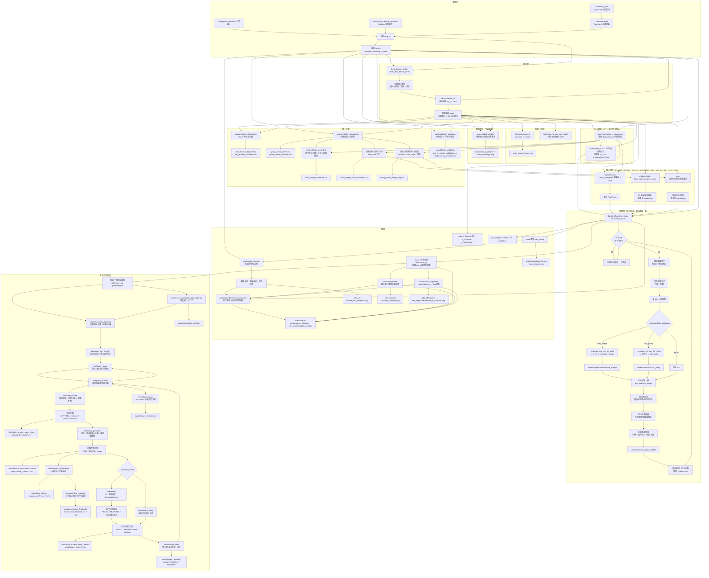

# 主流程与各模块说明（含流程图）

本文描述从 `main.py` 入口到 **数据质量 → IC（含驱动融合列权）→ 因子诊断（Top-K 多头超额 + 分组收益单调性）→ 多因子权重建议 → 样本外验证与因子失效监控 → 回测（因子 Top-K → 等权 / 夏普 / 风险平价配权）→ 基准与超额收益 → 换手与成本 → 风险暴露与集中度 → 绩效与落盘** 的顺序，以及各目录模块在流程中的位置与职责。与 [INTERFACE_AND_CONTRACTS.md](./INTERFACE_AND_CONTRACTS.md) 互补。**下文主体是 MVP 研究回测主流程**；`live.order_builder`、`live.order_precheck`、`live.paper_trading`、`live.broker`、`live.account_state`、`live.paper_runner`、`live.paper_report`、`live.manual_confirmation`、`live.execution_feedback`、`live.paper_guard`、`live.paper_run_control`、`live.paper_scheduler` 与 `scripts/run_daily_paper.py` / `scripts/run_scheduled_daily_paper.py` / `scripts/build_execution_feedback.py` 已作为准实盘准备层，用于把目标权重转换成订单计划、检查可执行性、用虚拟账户或模拟券商验证成交协议、保存纸面账户状态、生成日报和人工确认单、回填真实成交并分析执行偏差、检查异常、保护交易日运行和重复写入，并提供可交给系统调度器的单次运行入口；日终纸面交易已可通过 `--execution-mode simulated_broker` 走统一券商接口，`RealBrokerReadOnlyAdapter` 已提供真实券商只读骨架，但尚未接入真实交易 API。

---

## 1. 总流程图（Mermaid）

夏普 / 风险平价在样本不足或外层异常时该期回退 **等权**（与下文第 3 节、`rebalance_log[].weighting` 一致）；`risk_parity` 优化器内部失败时回退逆波动率，仍记 `risk_parity`。若 `Settings.max_position_weight` 可行且触发裁剪，标签会追加 `_capped`；若 `Settings.max_industry_weight` 在 `(0, 1)`，目标权重会先限制单个行业暴露；若 `Settings.target_volatility > 0`，回测会用历史协方差估算组合年化波动，超目标时降低股票仓位并保留现金；若 `Settings.min_positions > 0` 且有效目标持仓数不足，会把股票总仓位缩到 `min_positions_exposure`；若 `Settings.max_rebalance_turnover` 触发调仓节流，标签会追加 `_turnover_capped`。若配置了 `Settings.min_avg_volume` / `min_avg_amount`，Top-K 前会先做可交易性过滤，并把过滤前后候选数写入 `rebalance_log`；若开启 `enable_trade_status_filter`，停牌 / 涨停 / 跌停约束会在撮合前调整目标权重；逐股票的入选、过滤、行业调整、波动率缩放、最小持仓缩放、交易阻断和节流原因写入 `decision_log`。**融合路径**：默认用 **滞后滚动 IC 均值** 对 z-score 后各因子列加权（见 `fuse_ic_weighted_zscore`）；IC **不**进入 Top-K 内 `maximize_sharpe` / `risk_parity` 的 μ、Σ。

---

## 2. 按执行顺序说明（与 `main()` 大致一致）

| 顺序 | 位置 | 做什么 | 意义 |
|------|------|--------|------|
| 1 | `config.get_settings()` | 读路径、区间、`top_k`、费率、`portfolio_weighting`、IC 前瞻天数等 | 集中参数，避免魔法数 |
| 2 | `live/stock_pool` + `live/data_feed` + `backtest_utils` | 优先本地 demo / Tushare 缓存；否则从 Excel/CSV 股票池读取标的并拉取 Tushare 日线，得到 `long_df`、`prices` 宽表 | 摆脱默认示例股票池，统一真实股票池、行情缓存与回测数据形态 |
| 3 | `factors/panel_builder` | 计算动量、长动量、短反转、低波、成交量放大、PE、ROE、毛利率、净利率、低资产负债率、营收增长、利润增长等基础列 | **Alpha/打分**：谁相对更值得持有（仅使用 ≤当日 信息） |
| 4 | `factors/factor_ml` | 用基础因子作为特征、未来收益作为标签，按时间滚动训练梯度提升类模型并追加 `ML_SCORE` | 把机器学习作为候选因子，而不是直接替代策略；训练样本只使用预测日前可观察到完整标签的历史数据 |
| 5 | `analysis/data_quality` | 统计价格覆盖、因子覆盖、调仓日有效截面 | 判断结果是否建立在足够样本上 |
| 6 | `factors/preprocess` + `live/cache_io.save_run_cache`（可选） | 生成横截面标准化因子面板，并写 `output/cache/*.csv` | 复现与离线分析；多因子融合使用统一 z-score 口径 |
| 7 | `analysis/ic` | 每个交易日：因子 vs **前瞻**收益的截面 Spearman；汇总 mean_IC、分位数、正负占比与滚动稳定性 | **因子评价**；并作为 **融合列权** 输入（滞后 rolling，见 `fuse_ic_weighted_zscore`） |
| 8 | `analysis/factor_diagnostics` | 对每个因子构造 Top-K 等权多头腿；同时按因子从低到高分组，计算每组持有期收益、Top-Bottom 与单调性 | 回答“高分组有没有主动收益”以及“全排序是否有收益层次”，介于 IC 与完整回测之间 |
| 9 | `models/factor_weighting` | 综合 IC、rolling IC、Top-Bottom 与单调性，生成 `factor_score` / `fusion_weight` 建议表；同时可在训练段和调仓日前历史窗口生成实际使用的权重 | 把因子评价结果转成可审计、可验证、可滚动更新的权重 |
| 10 | `analysis/factor_validation` | 把 IC、多头超额、Top-Bottom 与单调性按训练段 / 验证段拆开比较，并生成失效监控状态 | 回答“训练期有效的因子，样本外是否还有效”，为后续剔除、降权或观察因子提供证据 |
| 11 | `models/fusion` + `main` | 默认 **`fuse_ic_weighted_zscore`**（可关回等权）得到 `FUSED_ZSCORE`；训练段静态综合权重得到 `FUSED_SCORE_WEIGHTED`；调仓日前滚动综合权重得到 `FUSED_ROLLING_SCORE_WEIGHTED` | 三条融合路线并列对比：原 IC rolling、静态验证、滚动准实盘候选 |
| 12 | `backtest/backtest_single` | 逐日更新净值；在 **再平衡日** 用因子排序，先做可交易性 / 流动性过滤，再选 Top-K，并按 **等权**、**夏普** 或 **风险平价** 生成目标权重；之后经过单票权重上限、行业权重上限、波动率目标、最小持仓数量、单次换手上限；若开启交易状态约束，则限制停牌、涨停买入/加仓、跌停卖出/减仓；同步生成 `decision_log` | **模拟交易规则 + 决策审计**；先保证候选股票可交易，再控制股票/行业集中度、组合波动、最低分散度和换手，再判断目标交易是否可执行，并记录为什么买/卖/没买/买不了 |
| 13 | `analysis/performance.summarize` | 由净值序列算年化收益、波动、**事后夏普**、最大回撤 | **成绩单**：描述这条净值曲线，与 `maximize_sharpe`（配权目标）不是同一对象 |
| 14 | `backtest.backtest_multi` | **`run_multi_backtest(fused=...)`** 对融合得分回测（内部 `run_single_backtest`） | 多因子组合策略的一条净值 |
| 15 | `analysis/benchmark` | 构造股票池等权基准，计算超额收益、跟踪误差、信息比率 | 判断策略收益来自 alpha，还是来自市场/股票池整体上涨 |
| 16 | `analysis/turnover` | 由 `rebalance_log` 计算换手率、预估交易成本 | 判断收益是否依赖高频换仓，估算成本压力 |
| 17 | `analysis/risk_exposure` | 由 `rebalance_log` 计算 HHI、effective_n、Top 权重 | 判断持仓是否过度集中，补充组合风控视角 |
| 18 | `live/cache_io` 实验记录 | 写 `run_config.json`、`performance_summary.csv`、`factor_diagnostics/*.csv`、`factor_validation/*.csv`、`data_quality/*.csv`、`rebalance_logs/*.csv`、`decision_logs/*.csv`、`turnover_logs/*.csv`、`risk_exposure/*.csv` | 可复现、可对照、可审计 |
| 19 | `analysis/plotting.plot_nav` 等 | 净值 / 超额净值 / IC / 权重 / 换手 / 集中度 / 覆盖率图 | 可视化 |
| 20 | `live/order_builder` | 读取目标权重、当前持仓、最新价格、现金 / 总资产，按手数和最小订单金额生成订单计划 | 把研究层的“目标权重”转成准实盘层的“买卖多少股” |
| 21 | `live/order_precheck` | 对订单计划做现金、可卖数量、买入手数、最小订单金额、停牌 / 涨跌停检查 | 在纸面交易或真实下单前拦截明显不可执行订单 |
| 22 | `live/broker` | 定义 `BrokerAdapter`、`SimulatedBroker`、`RealBrokerReadOnlyAdapter`，统一查资金、查持仓、查订单、下单、撤单 | 给纸面、模拟和未来真实券商一个共同接口；真实券商先用只读 adapter 验证查询能力 |
| 23 | `live/paper_trading` | 只执行通过预检查的订单，按手续费更新虚拟现金和持仓，并记录成交 / 跳过原因 | 在不真实下单的前提下，验证订单执行后账户会如何变化 |
| 24 | `live/account_state` | 保存和读取纸面账户现金、持仓与每日快照 | 让纸面交易能跨天连续运行，而不是每次从初始资金重启 |
| 25 | `live/stock_pool` + `scripts/build_live_universe.py` | 从人工研究池、价格缓存和交易状态生成过滤报告与 `active_universe_<date>.csv` | 在券商接口前确认“今天系统允许在哪些股票里选”，避免直接拿人工池下单 |
| 26 | `live/paper_runner` | 读取账户状态，串联订单生成、预检查、执行模式选择、成交回报兼容、持仓更新、账户快照与 CSV 落盘 | 把多个准实盘零件收束成“每天运行一次”的可调用入口；可选通过 `SimulatedBroker` 执行 |
| 27 | `scripts/run_daily_paper.py` | 从 `output/rebalance_logs/<strategy>.csv` 读取最近目标权重，从 `output/cache/prices_wide_close.csv` 读取最新价格，调用 `run_daily_paper_trade` | 把函数入口变成可手动运行、后续可被定时任务调用的日终命令；支持 `--execution-mode simulated_broker` |
| 28 | `live/paper_report` | 将单日纸面运行结果整理成 Markdown 日报 | 每天跑完后可以直接复盘订单、阻断、成交、券商订单回报、持仓和账户变化 |
| 29 | `live/manual_confirmation` | 基于订单计划、预检查和可选因子失效监控生成 CSV / Markdown 人工确认单 | 让系统给建议、人手在券商终端执行；这是自动下单前的小资金安全闸门 |
| 30 | `live/execution_feedback` / `scripts/build_execution_feedback.py` | 读取人工确认单中的真实成交回填字段，比较建议订单和实际成交 | 让小资金手动交易之后能复盘执行数量、成交价格、滑点、未成交和部分成交 |
| 31 | `live/paper_guard` | 在日终纸面运行前检查目标权重、价格、日期，在运行后检查现金、持仓、订单检查和成交日志 | 把“看起来跑完了但输入/结果异常”的情况显式暴露；ERROR 阻断，WARNING 进入摘要和日报 |
| 32 | `live/paper_run_control` | 从价格缓存提取交易日日历，检查运行日是否为交易日，并检查同日纸面账户快照是否已存在 | 防止周末/节假日误写新快照，也防止重复运行无意覆盖账户状态 |
| 33 | `live/paper_scheduler` / `scripts/run_scheduled_daily_paper.py` | 运行一次日终纸面交易，记录调度参数、stdout、stderr 和退出码 | 让 cron / launchd / 服务器调度器有稳定入口，也让失败有可查日志 |
| 34 | `live/broker_reconcile` / `scripts/reconcile_paper_broker.py` | 对比纸面账户与只读券商账户的现金、总资产和逐股票持仓差异 | 在真实下单前先发现纸面账户和真实账户是否已经偏离 |

**说明**：`run_multi_backtest` 另支持 **`factors` + `weights` 线性加权** 合成得分（`multi_mode=linear_weight`），`main` 当前未使用。

---

## 3. 关键概念对照

- **再平衡（`rebalance_freq`，默认 `ME`）**：仅在 **每个自然月末的最后一个交易日**（与行情索引交集）触发；当日读取因子截面、执行选股与调仓逻辑，非再平衡日只估值、不调仓。  
- **Top-K 选股**：在再平衡日，对因子值 **降序** 排列，在有效价、有效因子条件下取前 `k` 只；**每期名单可变**，记录在 `meta["rebalance_log"]`。  
- **可交易性 / 流动性过滤**：若 `Settings.min_avg_volume` 或 `Settings.min_avg_amount` 为正，回测会在 Top-K 前按过去 `Settings.liquidity_lookback_days` 的平均成交量 / 成交额过滤候选股票。过滤前后候选数会写入 `rebalance_log`，方便判断当期策略是否因为流动性不足而无法选满。
- **停牌 / 涨跌停约束**：若 `Settings.enable_trade_status_filter=True`，回测读取 `is_suspended`、`is_limit_up`、`is_limit_down`。停牌不能买卖，涨停不能买入 / 加仓，跌停不能卖出 / 减仓；被阻断的动作会写入 `decision_log.trade_block_reason`。
- **决策审计日志**：`meta["decision_log"]` 逐股票记录 `factor_score`、`factor_rank`、`passed_liquidity_filter`、`selected_by_signal`、`previous_weight`、`raw_target_weight`、`final_target_weight`、`action` 和 `decision_reason`。它解释交易动作，不参与净值计算。
- **`portfolio_weighting=max_sharpe`**：在已得 `picks` 后，用 `prices` 上 **过去 `optimizer_return_window` 个交易日** 的日收益样本估计 **μ**、**Σ**；调用 `maximize_sharpe(μ, Σ)` 得权重；若样本不足等失败则 **回退等权**。  
- **`portfolio_weighting=risk_parity`**：同一窗口估计 **Σ**（不需 μ），调用 `risk_parity(Σ)` 得 ERC 权重；样本不足或异常则 **回退等权**（`rebalance_log[].weighting` 为 `risk_parity_fallback`）。优化器内部失败时 `risk_parity` 会回退 **逆波动率** 权重，仍记为 `risk_parity`。  
- **单票权重上限（`max_position_weight`）**：在目标权重生成后统一生效，默认 0.4；若某只股票超过上限，则裁剪到上限并把剩余权重分配给未触顶股票，标签如 `max_sharpe_capped` / `risk_parity_capped`。若上限因持仓数太少而不可行（例如 2 只股票上限 40%），则保留归一后的原权重。
- **行业权重上限（`max_industry_weight`）**：默认 0 表示关闭；设为 `(0, 1)` 后，回测从 `industry_col`（默认 `industry`）读取行业分类，在目标权重生成后限制单个行业最大暴露。若行业数据缺失，会把行业记为 `UNKNOWN` 或记录 `industry_missing_data`，方便后续补数据。
- **波动率目标（`target_volatility`）**：默认 0 表示关闭；设为正数后，回测按 `volatility_target_lookback_days` 的历史协方差估算目标组合年化波动。若估算波动超过目标，则按 `target_volatility / estimated_volatility` 缩小股票目标仓位，剩余作为现金；MVP 只降仓位，不加杠杆。
- **最小持仓数量（`min_positions`）**：默认 0 表示关闭；若有效目标持仓数少于阈值，则把股票总仓位缩到 `min_positions_exposure`，剩余保留现金，避免可交易标的不足时硬满仓。
- **订单计划（`live.order_builder`）**：回测结束后，可把最近一期 `rebalance_log` 中的 `picks/weights` 视为目标权重，再结合当前持仓、现金 / 总资产和最新价格，生成 `BUY/SELL`、目标股数、调整股数、预估金额与交易原因。该层只做订单计划，不做券商下单、不做成交回报。
- **订单预检查（`live.order_precheck`）**：订单计划生成后，检查买单现金是否足够、卖单可用股数是否足够、买入股数是否满足一手约束、订单金额是否过小，以及停牌 / 涨停买入 / 跌停卖出是否应阻断。输出 `PASS` / `BLOCK` 与原因，不修改订单、不模拟成交。
- **统一券商接口（`live.broker`）**：定义 `BrokerAdapter` 协议和 `BrokerAccount` / `BrokerPosition` / `BrokerOrder` 数据结构，让上层只关心查资金、查持仓、查订单、下单和撤单。`SimulatedBroker` 用同一协议做立即成交模拟；`RealBrokerReadOnlyAdapter` 固定只读，可查询账户、持仓和订单快照，但会阻断下单和撤单；未来接 QMT、PTrade 或其他券商时，只需要实现同一协议。
- **纸面 / 真实账户只读对账（`live.broker_reconcile`）**：读取纸面账户状态，再通过只读 `BrokerAdapter` 读取真实账户快照，比较现金、总资产、持仓股数和可用股数差异。该层只输出 CSV / Markdown 对账报告，不下单、不撤单。
- **纸面交易（`live.paper_trading`）**：读取订单计划和预检查结果，只对 `PASS` 订单做虚拟成交，按手续费更新现金和持仓；被预检查阻断或成交层现金 / 持仓不足的订单会记录为 `SKIPPED`。该层不连接券商。
- **纸面账户状态（`live.account_state`）**：纸面交易后，将现金写入 `account.csv`，持仓写入 `positions.csv`，每日快照追加到 `snapshots.csv`。下一次运行可先读取该状态，再继续生成订单、预检查和纸面成交。
- **每日纸面运行器（`live.paper_runner`）**：把账户读取、订单计划、订单预检查、执行模式选择、持仓更新、账户快照和落盘串成一个函数 `run_daily_paper_trade`。默认 `execution_mode="paper_trading"` 沿用旧纸面成交；切到 `execution_mode="simulated_broker"` 时，订单会先进入 `SimulatedBroker`，再转换为兼容的 `paper_trades`，让日报和账户状态继续复用。
- **日终纸面交易脚本（`scripts/run_daily_paper.py`）**：默认读取 `output/rebalance_logs/FUSED_ROLLING_SCORE_WEIGHTED.csv` 与 `output/cache/prices_wide_close.csv`，再调用 `run_daily_paper_trade`。可通过 `--strategy`、`--trade-date`、`--trade-status`、`--execution-mode simulated_broker`、`--no-persist`、`--no-report`、`--no-guard`、`--max-price-age-days`、`--allow-non-trading-day` 和 `--allow-rerun` 调整运行口径。
- **纸面交易日报（`live.paper_report`）**：默认随日终脚本生成 Markdown，路径为 `output/paper_reports/<strategy>/<date>.md`，内容包括运行摘要、执行模式、账户快照、较上一快照变化、今日订单、被阻断订单、纸面成交、券商订单回报、当前持仓和输出文件。
- **小资金人工确认实盘单（`live.manual_confirmation`）**：默认随日终脚本生成 CSV 和 Markdown，路径为 `output/live_orders/<strategy>/<date>_manual_confirm.csv/.md`。确认单包含订单建议、预检查结果、可选因子健康状态和人工回填字段；它只辅助人工下单，不触发真实交易。
- **真实成交回填与执行偏差分析（`live.execution_feedback`）**：人工在券商终端执行之后，把 `executed_qty`、`executed_price`、`operator`、`confirmed_at`、`execution_note` 回填到确认单，再运行 `scripts/build_execution_feedback.py`。输出路径为 `output/execution_feedback/<strategy>/`，用于统计 `FILLED/PARTIAL/OVERFILLED/NOT_EXECUTED/BLOCKED`、数量差异、金额差异和价格滑点。
- **运行失败 / 异常检查（`live.paper_guard`）**：默认随日终脚本启用。目标权重为空、价格缺失、价格无效、目标权重日期或价格日期晚于运行日、运行后现金为负等属于 ERROR；价格日期过旧、所有订单被阻断、成交层全部跳过等属于 WARNING。
- **交易日日历 / 重复运行保护（`live.paper_run_control`）**：默认随日终脚本启用。交易日日历来自 `prices_wide_close.csv` 的日期列；显式指定非交易日会被阻断，除非使用 `--allow-non-trading-day`。同一策略同一日期已有 `snapshots.csv` 记录时会被阻断，除非使用 `--allow-rerun`。
- **每日调度入口（`live.paper_scheduler` / `scripts/run_scheduled_daily_paper.py`）**：不在 Python 内部常驻循环，而是包装一次日终纸面交易并记录 `output/scheduler_logs/<date>.log`。系统层可以用 cron / launchd / 服务器任务调度器按固定时间调用它。
- **单次换手上限（`max_rebalance_turnover`）**：在单票上限、行业上限、波动率目标和最小持仓数量之后、撮合之前生效，默认 1.0；首次建仓不节流，之后若新旧目标权重差异和超过上限，则按比例从旧目标向新目标移动，并在 `rebalance_log` 记录 `target_turnover`、`turnover_capped`、`turnover_scale`。
- **IC 与融合（最小切片）**：各因子日 IC 经 **`shift(1)` + 滚动均值** 得到非负、按日归一的 **列权**，对横截面 z-score 后的多列因子加权求和 → **FUSED 得分** 再参与 Top-K 回测。单因子各列回测仍仅用该列得分，**不受** IC 列权影响。关闭：`config.fusion_use_ic_weights=False` 或缺 IC 时回退 **`fuse_equal_weight_zscore`**。  
- **IC 分布与稳定性**：`analysis.ic.ic_distribution_summary` 统计 p05/p25/median/p75/p95、正负 IC 占比和极端值；`ic_rolling_stability` 按 `Settings.ic_rolling_windows` 统计滚动均值末值、滚动均值正值比例等，用来判断因子是否只靠少数日期支撑。
- **因子清洗与标准化**：`factors.preprocess` 对每个交易日、每列因子做横截面 winsorize 与 z-score，缓存到 `factor_panel_zscore.csv`；单因子排序仍可用原始因子，多因子融合复用同一套 z-score 口径。
- **质量与成长因子**：`factors.factor_finance` 将毛利率、净利率、低资产负债率、营收增长和利润增长按 `ann_date` 对齐到交易日；只使用当时已经公告的数据，避免把未来财报提前放进回测。
- **机器学习打分因子（`ML_SCORE`）**：`factors.factor_ml` 用基础因子作为特征，用未来 `ml_score_forward_days` 日收益作为标签，按时间滚动训练梯度提升类模型。预测日 `t` 的训练样本只允许使用 `feature_date + forward_days <= t` 的历史样本，避免标签泄漏。`ML_SCORE` 只是候选因子，仍需经过 IC、分组收益、样本外验证和回测。
- **因子多头超额**：`analysis.factor_diagnostics` 不做复杂配权、不计交易成本，只看某个因子 Top-K 等权多头腿相对股票池等权基准的主动收益；它是判断“因子有没有多头解释力”的中间层，不替代完整回测。
- **分组收益与单调性**：同一诊断层还会把每个调仓日的股票按因子从低到高分成 `Settings.factor_group_count` 组，计算每组到下一调仓日的平均收益。`top_minus_bottom_*` 看高分组减低分组，`monotonicity_score` 看长期分组均值是否随因子分数升高而递增。
- **多因子权重建议与验证**：`models.factor_weighting` 将 `mean_ic`、`ic_ir`、正 IC 占比、rolling IC、Top-Bottom 与单调性转成 `factor_score` 和 `fusion_weight`。全样本 `factor_weight_summary.csv` 用于诊断审计；训练段 `factor_weight_train_summary.csv` 会被 `fuse_static_weight_zscore` 固定成 `FUSED_SCORE_WEIGHTED`；滚动日志 `rolling_factor_weight_log.csv` 记录每个调仓日前的历史窗口、raw/constrained/final 权重和 fallback 原因，并生成 `FUSED_ROLLING_SCORE_WEIGHTED`。
- **样本外验证与因子失效监控**：`analysis.factor_validation` 使用和因子诊断相同的 IC、多头超额、分组收益口径，但按时间切成训练段和验证段。`out_of_sample_validation.csv` 看指标有没有从训练期掉到样本外；`factor_decay_monitor.csv` 把结果压缩成 `OK/WATCH/DEGRADED/FAILED`。
- **IC**：在面板与价格就绪后即可算；除上述融合外，**不写入** Top-K 内股票层优化的 μ、Σ。  
- **绩效里的「夏普比率」**：对 **已实现净值** 的年化收益/年化波动比；**不是**优化器在调仓时最大化的那个目标（尽管名字相近）。
- **数据质量与覆盖率**：价格覆盖率看每只股票有多少有效交易日；因子覆盖率看每列因子在 `(date, symbol)` 网格上的非空比例；调仓日覆盖率看每期真实可用于排序和交易的截面规模。
- **基准与超额收益**：当前基准为 **股票池每日等权**，不依赖外部指数数据。策略收益减基准收益得到主动收益；主动收益的年化波动是 **tracking_error**，主动收益年化均值除以 tracking_error 是 **information_ratio**。
- **换手率（turnover）**：当前定义为本期目标权重相对上期目标权重的绝对变化和，近似「成交金额 / 组合净值」。初次建仓通常约为 1.0；预估成本为 `turnover * commission_rate`。
- **HHI 与 effective_n**：HHI 是持仓权重平方和，越高代表越集中；`effective_n = 1 / HHI`，可理解为“等效持仓只数”。例如 5 只股票完全等权时 effective_n≈5，若资金主要压在 2 只股票上，effective_n 会明显降低。

---

## 4. 配置开关

| 字段 | 含义 |
|------|------|
| `Settings.portfolio_weighting` | `"equal"`：Top-K 等权；`"max_sharpe"`：夏普最大化；`"risk_parity"`：等风险贡献（ERC） |
| `Settings.max_position_weight` | 单票目标权重上限；默认 `0.4`，`0` 或 `>=1` 可视为关闭 |
| `Settings.max_industry_weight` | 单个行业目标权重上限；默认 `0` 表示关闭，开启后读取 `Settings.industry_col` |
| `Settings.industry_col` | 行业字段名，默认 `industry`；可来自 `long_prices` 或单独传入 `industry_data` |
| `Settings.target_volatility` | 组合目标年化波动；默认 `0` 表示关闭，开启后超目标则降低股票仓位 |
| `Settings.volatility_target_lookback_days` / `volatility_target_min_obs` | 估算目标组合波动使用的历史收益窗口和最少样本 |
| `Settings.min_positions` / `min_positions_exposure` | 最小有效目标持仓数，以及不足时允许的最高股票总仓位 |
| `Settings.order_lot_size` / `min_order_amount` / `order_cash_buffer` | 订单生成和预检查的最小交易单位、最小订单金额与现金缓冲；A 股默认一手 100 股 |
| `Settings.paper_initial_cash` | 纸面交易虚拟账户默认初始资金 |
| `Settings.max_rebalance_turnover` | 单次再平衡目标权重变化上限；默认 `1.0`，`0` 表示关闭 |
| `Settings.liquidity_lookback_days` | 可交易性过滤的成交量 / 成交额均值窗口 |
| `Settings.min_avg_volume` / `min_avg_amount` | 最小平均成交量 / 成交额；默认 `0` 表示关闭对应过滤 |
| `Settings.enable_trade_status_filter` | 停牌 / 涨跌停交易状态约束；默认关闭 |
| `Settings.optimizer_return_window` | 估计 μ、Σ（或仅 Σ）时使用的历史日收益窗口长度 |
| `Settings.optimizer_min_obs` | 窗口内有效样本少于该数则不对该期做优化，回退等权 |
| `Settings.ic_forward_days` | IC 用前瞻收益 horizon（默认 1 个交易日收盘对收盘） |
| `Settings.ic_rolling_windows` | IC 稳定性诊断窗口，默认 20 / 60 |
| `Settings.factor_group_count` | 因子分组收益诊断的分组数，默认 5；低分组为 G1，高分组为 G5 |
| `Settings.fusion_use_ic_weights` | `True`（默认）时 FUSED 用 IC 滚动列权融合；`False` 时等权 z-score |
| `Settings.fusion_ic_rolling_window` / `fusion_ic_min_periods` | IC 列权的 rolling 窗口与最少样本 |
| `Settings.factor_weight_train_ratio` | 静态综合权重融合的训练样本占比；默认 `0.5`，训练段算权重，验证段跑 `FUSED_SCORE_WEIGHTED` |
| `Settings.rolling_factor_weight_lookback_days` / `rolling_factor_weight_min_days` | 滚动综合权重每期可用的历史窗口与最少历史样本 |
| `Settings.rolling_factor_weight_min_weight` / `rolling_factor_weight_max_weight` | 滚动综合权重的单因子权重下限与上限 |
| `Settings.rolling_factor_weight_smoothing` | 滚动综合权重新旧权重平滑系数 |

更细的函数契约见 [INTERFACE_AND_CONTRACTS.md](./INTERFACE_AND_CONTRACTS.md)。

## 5. 实验记录输出

当 `Settings.persist_run_outputs=True` 时，主流程除行情 / 因子 / IC 缓存和 PNG 图外，还会写：

| 路径 | 含义 |
|------|------|
| `output/data_quality/price_coverage.csv` | 每只股票价格有效天数、缺失天数与覆盖率 |
| `output/data_quality/factor_coverage.csv` | 每个因子的有效单元格、缺失单元格与覆盖率 |
| `output/data_quality/factor_daily_coverage.csv` | 每天每个因子的有效股票数与覆盖率 |
| `output/data_quality/rebalance_coverage.csv` | 调仓日价格 / 因子有效截面规模 |
| `output/data_quality/factor_coverage.png` | 因子覆盖率柱状图 |
| `output/cache/run_config.json` | 本次 `Settings` 配置快照（Path 转字符串，含写入时间） |
| `output/cache/factor_panel_zscore.csv` | 横截面去极值 + z-score 后的标准化因子面板 |
| `output/ic_diagnostics/ic_distribution_summary.csv` | 各因子的 IC 分布分位数、正负占比、极端值和基础统计 |
| `output/ic_diagnostics/ic_rolling_stability.csv` | 各因子在不同 rolling 窗口下的 IC 稳定性指标 |
| `output/factor_diagnostics/long_excess_summary.csv` | 每个因子的 Top-K 多头腿相对股票池等权基准的超额收益、跟踪误差、信息比率 |
| `output/factor_diagnostics/group_return_detail.csv` | 每个因子、每个调仓日、每个分组的持有期收益与组内股票数 |
| `output/factor_diagnostics/group_return_summary.csv` | 每个因子分组的平均收益、年化收益、胜率、Top-Bottom、单调性评分 |
| `output/factor_diagnostics/factor_weight_summary.csv` | 全样本综合因子评分和融合权重建议，用于诊断审计 |
| `output/factor_diagnostics/factor_weight_train_summary.csv` | 训练段综合因子评分和静态融合权重，实际用于 `FUSED_SCORE_WEIGHTED` 验证回测 |
| `output/factor_diagnostics/rolling_factor_weight_log.csv` | 每个调仓日前滚动计算的因子权重、权重上下限 / 平滑后的结果和 fallback 原因，实际用于 `FUSED_ROLLING_SCORE_WEIGHTED` |
| `output/factor_validation/out_of_sample_validation.csv` | 每个因子训练段与样本外验证段的 IC、多头超额、Top-Bottom 和单调性对照 |
| `output/factor_validation/factor_decay_monitor.csv` | 每个因子的失效监控状态、严重程度和触发原因 |
| `output/performance_summary.csv` | 各策略绩效汇总：`strategy`, `ann_return`, `ann_vol`, `sharpe`, `max_drawdown`，以及相对基准、换手成本和集中度指标 |
| `output/rebalance_logs/<strategy>.csv` | 各策略逐次调仓明细：`date`, `symbol`, `weight`, `weighting`, `rank`，以及 `target_turnover`、`turnover_capped`、行业上限、波动率目标、最小持仓检查、现金目标仓位、流动性过滤前后候选数量等 |
| `output/decision_logs/<strategy>.csv` | 各策略逐股票决策审计：因子分数/排名、是否通过流动性过滤、是否入选、行业、上期/目标/最终权重、动作与原因标签 |
| `output/excess_nav_compare.png` | 各策略相对股票池等权基准的超额净值图 |
| `output/turnover_logs/<strategy>.csv` | 各策略逐次调仓换手：`date`, `turnover`, `estimated_cost`, `n_positions`, `weighting` |
| `output/turnover_compare.png` | 各策略逐期换手率对比图 |
| `output/risk_exposure/concentration_logs/<strategy>.csv` | 各策略逐次调仓集中度：`hhi`, `effective_n`, `top1_weight`, `top3_weight`, `n_positions` 等 |
| `output/risk_exposure/concentration_summary.csv` | 各策略集中度汇总：平均/最小 effective_n、最大 HHI、Top 权重等 |
| `output/live_universe/stock_pool_filter_report_<date>.csv` | 实盘前股票池过滤报告：代码规范化、启用状态、价格覆盖、最新价格、流动性、停牌 / 涨跌停和剔除原因 |
| `output/live_universe/active_universe_<date>.csv` | 当日实盘目标池确认文件，只保留通过过滤的股票，供后续策略运行、纸面交易和券商接口读取 |
| `output/risk_exposure/effective_n_compare.png` | 各策略 effective_n 对比图 |

---

## 6. 文档与代码同步

本仓库**无**自动生成文档或 CI 校验「文档 vs 实现」。**约定**：修改 `main.py`、`config.Settings` 或回测/IC 行为时，同步更新 **本文**、`ENGINEERING_OVERVIEW.md`、`README.md` 及 `INTERFACE_AND_CONTRACTS.md` 中相关段落，并在提交说明中注明。
