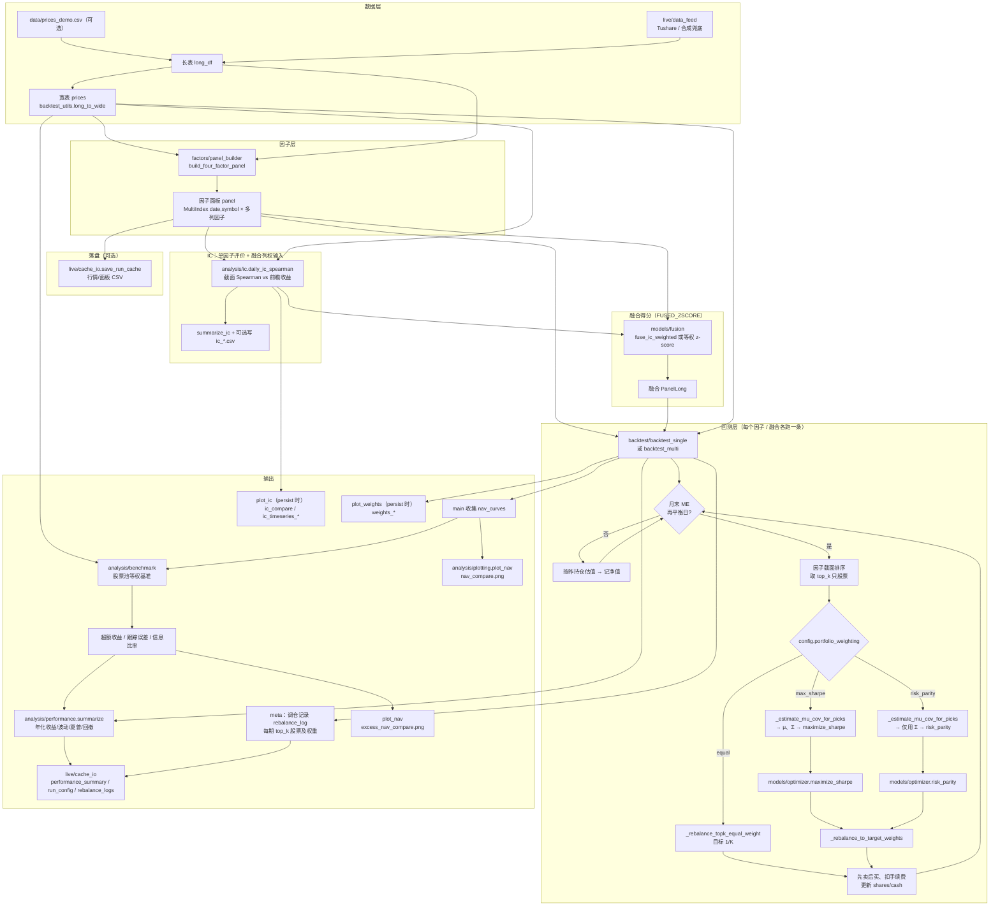

# 主流程与各模块说明（含流程图）

本文描述从 `main.py` 入口到 **IC（含驱动融合列权）→ 回测（因子 Top-K → 等权 / 夏普 / 风险平价配权）→ 基准与超额收益 → 绩效与落盘** 的顺序，以及各目录模块在流程中的位置与职责。与 [INTERFACE_AND_CONTRACTS.md](./INTERFACE_AND_CONTRACTS.md) 互补。**下文即 MVP 主流程**（不含 `live` 信号/模拟盘）。

---

## 1. 总流程图（Mermaid）

夏普 / 风险平价在样本不足或外层异常时该期回退 **等权**（与下文第 3 节、`rebalance_log[].weighting` 一致）；`risk_parity` 优化器内部失败时回退逆波动率，仍记 `risk_parity`。**融合路径**：默认用 **滞后滚动 IC 均值** 对 z-score 后各因子列加权（见 `fuse_ic_weighted_zscore`）；IC **不**进入 Top-K 内 `maximize_sharpe` / `risk_parity` 的 μ、Σ。

---

## 2. 按执行顺序说明（与 `main()` 大致一致）

| 顺序 | 位置 | 做什么 | 意义 |
|------|------|--------|------|
| 1 | `config.get_settings()` | 读路径、区间、`top_k`、费率、`portfolio_weighting`、IC 前瞻天数等 | 集中参数，避免魔法数 |
| 2 | `live/data_feed` + `backtest_utils` | 得到 `long_df`、`prices` 宽表 | 统一行情形态，供因子与回测共用 |
| 3 | `factors/panel_builder` | 计算 MOMENTUM / VOLATILITY / PE / ROE 等列 | **Alpha/打分**：谁相对更值得持有（仅使用 ≤当日 信息） |
| 4 | `live/cache_io.save_run_cache`（可选） | 写 `output/cache/*.csv` | 复现与离线分析 |
| 5 | `analysis/ic` | 每个交易日：因子 vs **前瞻**收益的截面 Spearman；汇总 mean_IC 等 | **因子评价**；并作为 **融合列权** 输入（滞后 rolling，见 `fuse_ic_weighted_zscore`） |
| 6 | `models/fusion` + `main` | 默认 **`fuse_ic_weighted_zscore`**（可关回等权）得到 FUSED 得分 | **IC 进入决策**的最小切片：只影响 **多因子如何合成一列** |
| 7 | `backtest/backtest_single` | 逐日更新净值；在 **再平衡日** 用因子选 Top-K，再按 **等权**、**夏普** 或 **风险平价** 调仓 | **模拟交易规则**；配权发生在 **已选股之后**，只决定 K 只里的资金比例 |
| 8 | `analysis/performance.summarize` | 由净值序列算年化收益、波动、**事后夏普**、最大回撤 | **成绩单**：描述这条净值曲线，与 `maximize_sharpe`（配权目标）不是同一对象 |
| 9 | `backtest.backtest_multi` | **`run_multi_backtest(fused=...)`** 对融合得分回测（内部 `run_single_backtest`） | 多因子组合策略的一条净值 |
| 10 | `analysis/benchmark` | 构造股票池等权基准，计算超额收益、跟踪误差、信息比率 | 判断策略收益来自 alpha，还是来自市场/股票池整体上涨 |
| 11 | `live/cache_io` 实验记录 | 写 `run_config.json`、`performance_summary.csv`、`rebalance_logs/*.csv` | 可复现、可对照、可审计 |
| 12 | `analysis/plotting.plot_nav` 等 | 净值 / 超额净值 / IC / 权重图 | 可视化 |

**说明**：`run_multi_backtest` 另支持 **`factors` + `weights` 线性加权** 合成得分（`multi_mode=linear_weight`），`main` 当前未使用。

---

## 3. 关键概念对照

- **再平衡（`rebalance_freq`，默认 `ME`）**：仅在 **每个自然月末的最后一个交易日**（与行情索引交集）触发；当日读取因子截面、执行选股与调仓逻辑，非再平衡日只估值、不调仓。  
- **Top-K 选股**：在再平衡日，对因子值 **降序** 排列，在有效价、有效因子条件下取前 `k` 只；**每期名单可变**，记录在 `meta["rebalance_log"]`。  
- **`portfolio_weighting=max_sharpe`**：在已得 `picks` 后，用 `prices` 上 **过去 `optimizer_return_window` 个交易日** 的日收益样本估计 **μ**、**Σ**；调用 `maximize_sharpe(μ, Σ)` 得权重；若样本不足等失败则 **回退等权**。  
- **`portfolio_weighting=risk_parity`**：同一窗口估计 **Σ**（不需 μ），调用 `risk_parity(Σ)` 得 ERC 权重；样本不足或异常则 **回退等权**（`rebalance_log[].weighting` 为 `risk_parity_fallback`）。优化器内部失败时 `risk_parity` 会回退 **逆波动率** 权重，仍记为 `risk_parity`。  
- **IC 与融合（最小切片）**：各因子日 IC 经 **`shift(1)` + 滚动均值** 得到非负、按日归一的 **列权**，对横截面 z-score 后的多列因子加权求和 → **FUSED 得分** 再参与 Top-K 回测。单因子各列回测仍仅用该列得分，**不受** IC 列权影响。关闭：`config.fusion_use_ic_weights=False` 或缺 IC 时回退 **`fuse_equal_weight_zscore`**。  
- **IC**：在面板与价格就绪后即可算；除上述融合外，**不写入** Top-K 内股票层优化的 μ、Σ。  
- **绩效里的「夏普比率」**：对 **已实现净值** 的年化收益/年化波动比；**不是**优化器在调仓时最大化的那个目标（尽管名字相近）。
- **基准与超额收益**：当前基准为 **股票池每日等权**，不依赖外部指数数据。策略收益减基准收益得到主动收益；主动收益的年化波动是 **tracking_error**，主动收益年化均值除以 tracking_error 是 **information_ratio**。

---

## 4. 配置开关

| 字段 | 含义 |
|------|------|
| `Settings.portfolio_weighting` | `"equal"`：Top-K 等权；`"max_sharpe"`：夏普最大化；`"risk_parity"`：等风险贡献（ERC） |
| `Settings.optimizer_return_window` | 估计 μ、Σ（或仅 Σ）时使用的历史日收益窗口长度 |
| `Settings.optimizer_min_obs` | 窗口内有效样本少于该数则不对该期做优化，回退等权 |
| `Settings.ic_forward_days` | IC 用前瞻收益 horizon（默认 1 个交易日收盘对收盘） |
| `Settings.fusion_use_ic_weights` | `True`（默认）时 FUSED 用 IC 滚动列权融合；`False` 时等权 z-score |
| `Settings.fusion_ic_rolling_window` / `fusion_ic_min_periods` | IC 列权的 rolling 窗口与最少样本 |

更细的函数契约见 [INTERFACE_AND_CONTRACTS.md](./INTERFACE_AND_CONTRACTS.md)。

## 5. 实验记录输出

当 `Settings.persist_run_outputs=True` 时，主流程除行情 / 因子 / IC 缓存和 PNG 图外，还会写：

| 路径 | 含义 |
|------|------|
| `output/cache/run_config.json` | 本次 `Settings` 配置快照（Path 转字符串，含写入时间） |
| `output/performance_summary.csv` | 各策略绩效汇总：`strategy`, `ann_return`, `ann_vol`, `sharpe`, `max_drawdown`，以及相对基准的 `excess_ann_return`, `tracking_error`, `information_ratio` |
| `output/rebalance_logs/<strategy>.csv` | 各策略逐次调仓明细：`date`, `symbol`, `weight`, `weighting`, `rank` |
| `output/excess_nav_compare.png` | 各策略相对股票池等权基准的超额净值图 |

---

## 6. 文档与代码同步

本仓库**无**自动生成文档或 CI 校验「文档 vs 实现」。**约定**：修改 `main.py`、`config.Settings` 或回测/IC 行为时，同步更新 **本文**、`ENGINEERING_OVERVIEW.md`、`README.md` 及 `INTERFACE_AND_CONTRACTS.md` 中相关段落，并在提交说明中注明。
