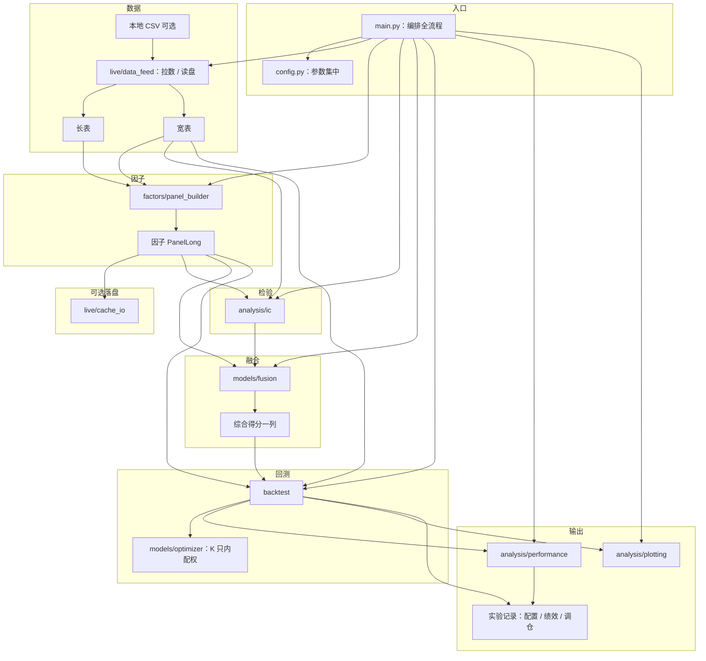

# Quant Strategy｜为什么要从一个「能跑全链路」的 MVP 开始？

若前面已经把 **因子、IC、回测口径** 讲透，读者里常会冒出一个更尖锐的问题：**既然最终要上实盘，为什么不直接按「生产级」目录与接口一口气开干？**

这不是「MVP 更懒」，而是它更 **不犯结构性错误**——它刻意先避开最难、最容易在工程里失控的那一块：**在链路没闭合之前，把复杂度堆到报单与撮合层**。下面从 **目标错位 → 断环代价 → 迭代行为 → 机制对比 → 可执行路径**，一层层把它讲清楚。

> **一句话结论：**全链路 MVP 往往比「大而全但未跑通」更有用，不是因为它更接近实盘，而是因为它先把 **数据 → 因子 → IC → 因子诊断（多头超额 + 分组收益）→ 融合 → 回测 → 交易约束与组合风控（含现金仓位）→ 风险暴露 → 绩效/图表** 钉成可回归的基准；后续每一刀改动都能回答「相对这条基线，我多了什么、少了什么」。
>
> **机制差异：**大工程早期常见「模块都有了、数据流没接上」；MVP 强制 **单一入口 `python main.py`** 走完同一套契约，避免「局部最优、全局跑不起来」。
>
> **为什么「断环」像毒药：**任何一环若只在 PPT 或孤立脚本里存在，对齐、前瞻收益、再平衡与手续费等 **隐性假设** 会在你加实盘时集中爆炸；届时很难分清是 alpha 问题还是管道问题。
>
> **工程画像：**无闭环仓库常见「改一处、三处红」、无法对比净值、IC 与融合逻辑漂移；MVP 更像一条 **绿色主分支**，先把研究侧骗不了自己的部分做实。
>
> **你现在可做：**以本仓库为骨架，所有新能力先 **挂在这条主流程的某一环上**；`config.py` 调参 → 出图与 CSV 对照；实盘与 `live` 信号放在 **链路末端**，前面每一增量都先在回测里验过。

---

把「你到底在造什么系统」先钉死，后面的直觉会顺很多：我们不是在比较两种 **谁更「高级」** 的目录名，而是在比较两种 **谁先承担不确定性** 的交付方式。

## 一、核心结论（一句话版本）

| 路线 | 心智模型 | 常见结果 |
| --- | --- | --- |
| 一口吃下「生产架构」 | 一步到位 | 链路长期不闭合 → 难回归、难排错 |
| 全链路 MVP（本仓库） | 先闭合、再加厚 | 可跑、可对照、可逐步接 `live`/实盘 |

注意这里的「更有用」更准确的表述往往是：**在迭代速度、排错成本与样本外可信度计入之后，净工程收益更高**——而不是 MVP 的因子一定更强。

---

上面是「结论表」，接下来要回答更底层的问题：**你到底在优先保证什么？** 一旦交付顺序写错，目录再漂亮也会变成「看起来很量化」。

## 二、最根本原因：你在建设「还没法验证的东西」

### 「生产先行」实际上在优化什么？

它在优化 **形态**：更多子包、更多抽象、更多「未来会用到的」接口——但前提是：**你已经有一条能反复跑、能反复比对的真值链**。否则你优化的是 **不可证伪的架构**。

### 全链路 MVP 在优化什么？

它在优化 **可验证性**：同一批数据、同一套对齐、同一套 IC/融合/回测契约，每次只改变少量参数或单模块，输出 **净值、IC、权重图** 都能对齐到「上一次跑了什么」。

### 核心差异（一张表就够）

| 路线 | 闭环是否先于复杂度 |
| --- | --- |
| 生产先行 | 否（常见） |
| 本仓库 MVP | 是（默认） |

到这里你应该能感到一条主线：**大工程把最难的「全局一致性」推迟；MVP 把最难的全局一致性提前做成门禁。**

---

「先闭合」听起来像保守，但在量化工程里往往不是。下一节专门解释：为什么 **链路断一截** 不是「以后再接就行」的小问题，而是会系统性毁掉你对 alpha 的判断。

## 三、为什么「断环」会毁掉你对结果的信心？

这是整个问题的核心。

### 1) 隐性假设会堆在接口缝里

举个真实情况：

你以为：

- 因子已经「算出来了」  
- 回测已经「能出净值了」

真实可能是：

- 财务对齐与前瞻收益窗口 **和 IC 模块假设不一致**  
- 融合列权用的 IC **滞后阶数** 与回测再平衡日 **错位半拍**  
- Top-K 内夏普配权用的 **μ、Σ 窗口** 与因子评价区间 **不是同一套日历**

**排序与权重都会「看起来能跑」**——但你在优化的是 **管道噪声**，不是策略。

### 2) 没有单一入口时，误差无法归因

因为：

$$
\text{你看到的净值变化} = f(\text{数据},\ \text{因子},\ \text{IC},\ \text{融合},\ \text{回测规则},\ \text{配权优化},\ \text{成本模型})
$$

直觉上记住一句就够：

**任何一环若不能与其他环在同一入口下重复跑，你就无法判断「这次改动到底改了哪一项」。**

### 3) 结果链条

**断环 → 不可回归 → 把历史噪声当成 alpha → 样本外加模块时集中翻车。**

---

把「断环」讲清之后，你自然会问：**那这些问题在工程迭代里「长什么样」？** 下一节用行为画像回答：你会在分支、日志与「谁也不敢动的主流程」里看见它们。

## 四、「生产先行」在研究迭代里的典型行为

### 1) 主流程长期不绿

多个子模块各有一个 `demo_*.py`，但没有 **一条** 命令能稳定产出「上次那张 IC 图、那条融合净值」。

### 2) 对照实验做不起来

典型叙事是：

- 上周：融合权重一版  
- 本周：换了数据清洗路径，但回测入口不同  

**无法对齐 → 无法写 changelog → 无法说服自己，更无法说服风控。**

### 3) 复杂度前移到「不可观测层」

一旦提前写报单、队列、重连，而研究侧未闭合，**故障会混在「策略表现」里**——排错成本指数级上升。

---

读到这里你可能会反驳：**MVP 会不会太简单，赚不到「架构红利」？** 关键在下一节：MVP 并不是「放弃实盘」，而是把 **「全局一致性」** 从未来挪到现在——让组合先站到一个 **更难被管道噪声骗倒** 的结构上。

## 五、为什么全链路 MVP「反而」更有用？

### 1) 它先保证「能证伪」

它主动把最大的不确定性之一——**全链路是否自洽**——变成每次 CI/每次本地运行都能回答的布尔问题。

### 2) 自动提供「对照实验台」

本仓库默认：**多列单因子各一条回测 + 多条融合回测**，IC 与融合开关集中在配置里——于是更不容易出现 **「只看过融合线，从未看过单因子是否全崩」** 的盲区。

### 3) 利用了「二阶结构比口头 alpha 更稳」这一工程共识

非常关键的一点是：

**协方差、波动、再平衡规则、手续费，往往比「口头叙事」更容易写成可执行契约。**

这句话不是定理，但它是很多研究工程的真实经验：**先把契约写死，再谈预测**——因此「先把链路跑绿」有时比「先把策略写炫」更赚钱（在研究净收益意义上）。

### 4) 天然的 anti-overfitting（工程版）

MVP 常见特性包括：

- 不追「单脚本样本内最优」  
- 强制单一编排（`main.py`）  
- 配置集中（`config.py`），减少魔法数漂移  

因此它更不容易把 **历史管道巧合**「编译」成未来的重仓自信。

---

为了把「断环迭代」和「绿主流程迭代」钉进直觉，下面用一个极简对照：它会让你一眼看到：**同一套研究目标，两种交付顺序如何做出完全不同的风险暴露。**

## 六、一个直观对比（非常重要）

假设你都要交付：**多因子 + IC 加权融合 + Top-K 内夏普/风险平价**。

### 路线 A：先堆模块、后接链路

- 因子、IC、回测各自成篇代码  
- **最后**才尝试统一日历与对齐  

### 路线 B：本仓库 MVP（先链路、后加厚）

- `main.py` 固定主流程（见下文表）  
- IC **不参与** Top-K 内夏普/风险平价的 μ、Σ（主流程里评价与配权分层），避免把「评价信号」误写进「配权优化输入」  

### 工程上会发生什么？

若数据对齐里有 **半拍错位**：

- 路线 A 更容易在「看起来很炫的融合线」里把错误吃进去  
- 路线 B 更容易在 **单因子 IC/净值** 上先暴露异常形态（更容易早发现、早修）

---

例子是简化的，但现实机制是同一类：**收益里信号与管道缠在一起**。下一节把这个机制抬到「世界观」层面：为什么 **单一入口** 特别像在用工程纪律对抗噪声。

## 七、一个非常深层的原因（很多人不知道）

量化研究的一个粗糙但好用的分解是：

$$
\text{你观察到的差异} = \text{真策略差异} + \text{管道差异} + \text{样本噪声}
$$

而且在很多团队与样本长度下，你会观察到：

$$
\text{管道差异} + \text{样本噪声} \gg \text{真策略差异（早期）}
$$

于是：

- **无闭环大仓库**：会把「看起来像 alpha」的东西用尽——其中必然包含大量管道与对齐噪声  
- **全链路 MVP**：几乎「强制你把管道噪声压到可重复基准以下」，再谈加模块

一句对比可以记在心里：

**大工程早期 ≈ 更敢在噪声上叠复杂度；MVP ≈ 主动先把噪声从权重（与结论）核心里挤出去（至少挤到可观测层）。**

---

讲完「世界观」，我们回到「这个仓库长什么样」。下面这张图与主流程表，是 **当前 Quant Strategy** 的工程契约总览；你加功能时，多半是加深某条边，而不是推翻入口。

## 八、本仓库：模块关系与主流程（总览）

与 `main.py` 编排顺序一致的主流程步骤（若主流程调整，以代码为准并同步更新本表）：

| 步 | 内容 |
|:--:|------|
| 1 | 读配置：路径、回测区间、调仓频率、Top-K、手续费、持仓配权方式、单票权重上限、行业权重上限、波动率目标、单次换手上限、IC 与融合相关开关、是否写盘等。 |
| 2 | 接行情：本地演示数据优先，其次内置股票池拉 Tushare，再不行合成数据，保证无外部密钥时仍能跑完演示。 |
| 3 | 构建多列因子面板：短/长动量、短反转、低波、成交量放大、PE 相关、ROE，索引对齐。 |
| 4 | 对因子面板做横截面 winsorize 与 z-score，生成标准化面板。 |
| 5 | 生成数据质量与覆盖率报告：价格、因子、调仓日有效截面。 |
| 6 | 可选：缓存行情、原始因子面板与标准化因子面板，便于复现与对比。 |
| 7 | 计算 IC 及汇总；融合得分与当前融合逻辑一致后再算一条 FUSED 的 IC。 |
| 8 | 对 IC 做分布与稳定性诊断：分位数、正负占比、滚动 IC。 |
| 9 | 计算每个因子的 Top-K 等权多头腿；同时做分组收益与单调性分析，判断高分组是否跑赢低分组。 |
| 10 | 生成多因子综合评分与权重建议表；全样本用于诊断审计，训练段权重会生成 `FUSED_SCORE_WEIGHTED`，调仓日前滚动权重会生成 `FUSED_ROLLING_SCORE_WEIGHTED`。 |
| 11 | 多列因子各跑一条回测。 |
| 12 | 融合得分（默认带 IC 列权，可关）再跑一条回测。 |
| 13 | 绩效汇总与终端打印。 |
| 14 | 构造股票池等权基准，计算超额收益、跟踪误差与信息比率。 |
| 15 | 在 Top-K 前按可选的平均成交量 / 成交额阈值做可交易性过滤，并把过滤前后候选数写入调仓日志。 |
| 16 | 可选启用行业权重上限，限制单个行业目标暴露，并记录行业上限是否触发、最大行业暴露和行业数量。 |
| 17 | 可选启用波动率目标，若目标组合估算年化波动过高，则降低股票仓位并保留现金。 |
| 18 | 可选启用停牌 / 涨跌停交易约束，限制停牌买卖、涨停买入 / 加仓、跌停卖出 / 减仓。 |
| 19 | 生成逐股票决策审计日志，解释每期为什么买、卖、保留、没买、被过滤、被行业约束调整、被波动率目标缩放或被交易状态阻断。 |
| 20 | 根据调仓日志计算换手率、预估交易成本。 |
| 21 | 根据调仓日志计算 HHI、effective_n、Top 权重等持仓集中度指标。 |
| 22 | 可选写实验记录：`run_config.json`、`performance_summary.csv`、`ic_diagnostics/*.csv`、`factor_diagnostics/*.csv`、`data_quality/*.csv`、`rebalance_logs/*.csv`、`decision_logs/*.csv`、`turnover_logs/*.csv`、`risk_exposure/*.csv`。 |
| 23 | 净值图、超额净值图、覆盖率图、换手图、集中度图、IC 图、权重图等；写盘时落 PNG 与 CSV。 |

**数据形态（工程口径）：**长表（一日一标的一行）、宽表（一日一行多标的列）、因子表（日期 × 标的得分；调仓日截面排序）。四列默认因子均约定 **分高者更优**；财务在回测起点前多取若干年历史，减轻样本初期空窗。

**IC 与融合（和单因子回测各管一截）：**单因子回测里 IC **不参与**选股与 K 只内资金比例；融合回测默认在 z-score 后用 **滞后滚动 IC** 做列权（可关退回等权）。综合评分权重也分为训练段静态验证和调仓日前滚动更新两条支路。K 只内夏普/风险平价 **只用选中股票的收益历史** 估 μ、Σ，不把 IC 混进组合层优化——这与「评价」和「交易」分层是同一类工程纪律。

**回测基线：**月末（默认）调仓、因子降序取前 K、先卖后买、单边手续费、现金不足缩买；配权失败回退等权并有标签可查。若目标权重超过 `max_position_weight`，会先裁剪单票权重上限；若开启 `max_industry_weight`，会继续限制单个行业暴露；若开启 `target_volatility` 且估算组合波动超过目标，会按比例降低股票仓位、剩余保留现金；若新旧目标权重变化超过 `max_rebalance_turnover`，会按比例向新目标移动，再进入交易状态检查与调仓撮合。

**输出与配置：**绩效为研究常用简化口径（与券商对账单可能不一致，实盘需再对齐）。日常多改 `config.py`；Token 建议只走环境变量。打开 `persist_run_outputs` 后，系统会把行情 / 因子 / IC 缓存、IC 分布稳定性诊断、数据质量报告、因子多头超额诊断、分组收益诊断、因子综合权重建议、训练段静态融合权重、配置快照、绩效汇总、调仓明细、换手日志、集中度日志、净值图、超额净值图、覆盖率图、换手图和有效持仓数图一并保存，方便之后比较两次实验到底差在哪里，也方便判断策略收益究竟来自股票池整体上涨、因子选择产生的相对收益、高换手带来的成本压力，还是少数股票上的集中押注。

---

MVP 不是银弹。把它缺点说清楚，你才能避免「从一个极端跳到另一个极端」。

## 九、全链路 MVP 有没有缺点？

有。

### 1) 不能代替生产工程

撮合、风控、报单、监控、容灾——**该做还得做**，只是顺序通常应放在 **研究链路灯亮之后**。

### 2) 可能显得「不够酷」

目录不会第一天就像投行 PPT 那样分层到极致；**酷」应该来自 **可重复证据链**，而不是来自层数。

### 3) 在强基础设施团队里可能显得慢

若你已有成熟数据与中台，MVP 叙述要升级为 **「对齐你们中台的契约层」**，而不是重复造轮子。

---

所以更成熟的答案通常不是「只写 main」或「只写生产」，而是 **分层**：底层负责 **别在管道上犯大错**，上层负责 **在可信范围内进攻**。

## 十、真正贴近工程实践的做法（最重要）

**没有人会永远停在 MVP。**

一个很常见的表达是：

- **骨架：单一入口 + 配置集中 + 全链路输出可对照**（本仓库）  
- **增强：逐模块加厚**（更多因子、成本模型、约束、信号、仿真、实盘）

直觉是：

**先用绿主流程定「真值」，再把复杂度一层层挂上去——每一层都要能解释「相对基线多了什么」。**

---

把方法收束之后，最后要把认知落到一句话：量化里最难的不是多写一个类，而是分清 **什么是策略、什么是管道、什么该先进目标函数（或先进仓库）**。

## 十一、给你一个最终认知（非常关键）

在量化工程里：

- **预测与排序（alpha）往往最难、最噪**  
- **契约、对齐、可回归（engineering）往往最可靠、最好先固化**

---

## 十二、一句话总结

**全链路 MVP 赢，往往不是因为它更强，而是因为它更不犯大错。**

---

## 结论

从一个「能跑全链路」的 **Quant Strategy** MVP 开始，通常不是因为它在样本内更「完整」，而是因为它默认把最难排错的一类问题前置：**数据与因子对齐、IC 与融合逻辑、回测与配权分层是否自洽**。相对地，在链路未闭合时堆生产复杂度，更容易把估计与实现误差混进净值曲线，使你在样本外与加实盘阶段付出指数级排错成本。

但这不意味着 MVP 更高明：在强中台与成熟风控已存在时，重复造「数据层」可能浪费；在团队已能稳定维护多入口时，单一 `main.py` 也需要演进为可测试子模块 API。更贴近实践的路径，是 **以可回归全链路为门禁**，再逐层接入更丰富因子、成本与约束、信号与仿真、真实报单，并配合配置与落盘，让系统同时满足 **可解释、可对照、可扩展** 与 **有限进攻性**。

---

*仓库默认行为或参数变更时，请同步更新本文表述，以免与代码脱节。*
