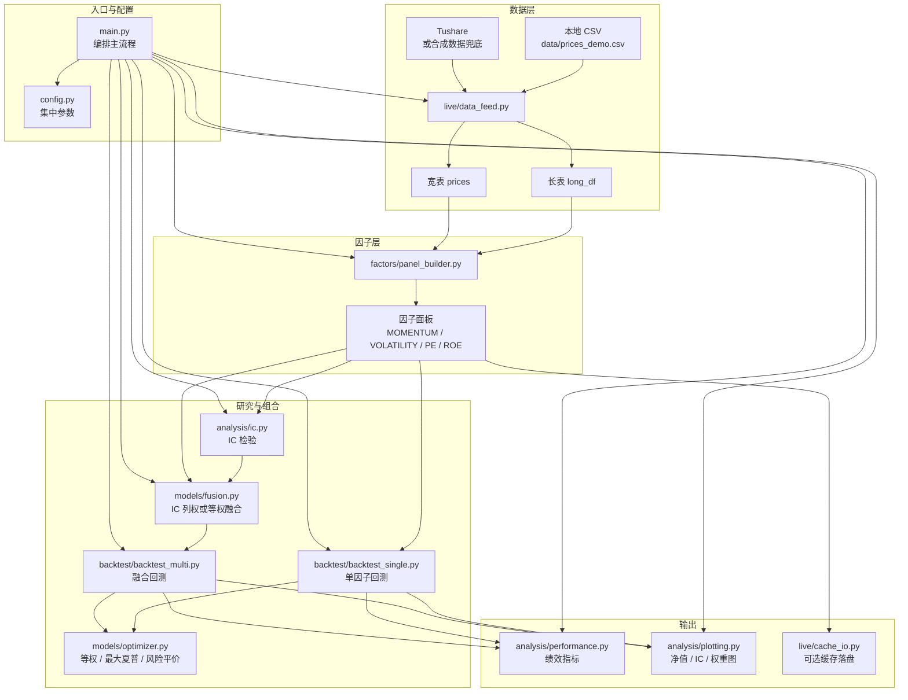

# 从一个 MVP 量化工程开始：用一条完整链路理解量化系统

如果你刚开始接触量化，很容易被两个方向拉扯。

一个方向是策略公式：动量、估值、波动率、IC、夏普率、风险平价。每个概念单独看都不难，但真正写代码时，经常会发现它们散落在不同脚本里，彼此接不上。

另一个方向是“专业工程”：数据中台、任务调度、因子库、回测平台、组合优化、风控、订单系统、监控告警。听起来很完整，但如果一开始就追求大而全，项目很容易变成目录很多、接口很多，却没有一条链路可以稳定跑通。

所以这个系列不会从“如何写一个最炫的因子”开始，也不会一上来就搭一个看起来很机构级的空架子。

我会从一个 MVP 级别的量化工程开始。

它很简单，但它有一件事是完整的：

```text
数据 → 因子面板 → IC 检验 → 单因子回测 → 多因子融合
→ 组合配权 → 绩效分析 → 图表输出 → 可选落盘
```

这就是当前仓库 `Quant Strategy` 的核心定位。

它不是一个实盘交易系统，也不是一个已经覆盖所有细节的专业回测平台。它更像一条已经闭合的研究主线：你可以从 `python main.py` 开始，真实走完一次量化研究中最基础、也最容易出错的流程。

这一篇先不深入每个模块的代码细节，而是整体讲清楚：这个工程在做什么，为什么要从 MVP 开始，以及后续如何把它一步步演进成更接近专业级、机构级的量化工程。

---

## 一、这个工程到底解决什么问题？

很多量化入门代码的问题，不是单个函数写得不对，而是没有形成闭环。

比如你可能有一个因子脚本，可以算出动量；也有一个回测脚本，可以画净值；还可能有一个绩效脚本，可以算夏普率。但关键问题是：

- 这些脚本使用的是同一份数据吗？
- 因子日期和收益日期有没有错位？
- IC 用的前瞻收益和回测调仓日是否一致？
- 多因子融合时，每个因子有没有做横截面标准化？
- 回测里的选股、配权、手续费是否能复现？
- 这次改动以后，能不能和上一次结果做对照？

如果这些问题没有被工程结构固定下来，策略结果就会变得很危险。

你看到的净值变化，可能来自真实 alpha，也可能来自数据对齐、未来函数、调仓口径、缺失值处理、手续费假设，甚至只是某个脚本里临时写死的参数。

所以这个 MVP 工程首先解决的不是“找到最赚钱的策略”，而是先解决一个更基础的问题：

> 如何把量化研究最小但完整的一条链路固定下来，让每一次改动都有可对照、可复现、可解释的输出。

这也是这个项目最重要的价值。

---

## 二、为什么我不一开始就做“大而全”的生产架构？

因为量化工程里有一个常见误区：把“目录看起来专业”误认为“系统已经专业”。

真正专业的量化系统当然需要很多能力：数据治理、因子管理、实验追踪、风控、模拟盘、实盘报单、监控、权限、容灾。但这些能力应该逐步挂到一条已经跑通的主流程上，而不是在研究链路还没闭合之前就全部铺开。

原因很简单：如果主流程不闭合，复杂度越高，越难判断问题出在哪里。

本仓库选择了相反的路线：

```text
先闭合，再加厚。
```

当前 MVP 的边界非常清楚：

- 在 MVP 内：行情接入、四因子面板、IC、单因子回测、多因子融合、Top-K 组合、等权 / 最大夏普 / 风险平价配权、绩效统计、图表输出、可选缓存落盘。
- 不在 MVP 内：真实券商 API、实时风控、订单路由、实盘信号系统、完整模拟盘、高阶机器学习融合模型。

这不是因为后者不重要，而是因为它们应该出现在更靠后的阶段。

研究侧没有稳定之前，贸然接实盘层，只会把“策略问题”和“工程问题”混在一起。等到净值不对、持仓不对、信号不对时，你很难判断到底是 alpha 不行，还是管道不一致。

MVP 的意义，就是先让系统有一条可以反复验证的基线。

---

## 三、项目的整体流程

当前工程的入口是 `main.py`，配置集中在 `config.py`。

运行方式很简单：

```bash
python main.py
```

这条命令背后会串起当前研究侧的完整流程。

可以先用一张简化流程图建立整体感觉：



这张图来自项目文档 `docs/FLOW_AND_MODULES.md` 的主流程口径，只是在文章里做了简化：保留模块关系和数据方向，省略了部分函数级细节。读代码时可以看这篇文章建立全局认识；真正要改模块时，再回到 `FLOW_AND_MODULES.md` 看完整流程图和逐步说明。

### 1. 读取配置

`config.py` 里集中管理路径、回测区间、调仓频率、Top-K 数量、手续费率、组合配权方式、IC 前瞻天数、多因子融合开关、是否落盘等参数。

这一步看似普通，但非常重要。量化研究最怕参数散落在多个脚本里：今天改了一个窗口，明天忘了另一个脚本里还有一个魔法数，最后结果无法复现。

集中配置，是工程化的第一步。

### 2. 获取行情数据

数据层在 `live/data_feed.py`。

当前主流程有三种数据来源：

- 优先读取本地 `data/prices_demo.csv`
- 如果没有本地数据，则尝试从 Tushare 拉取默认股票池数据
- 如果外部数据不可用，则回退到合成数据，保证演示链路仍能跑通

这里的设计重点不是数据源有多高级，而是让工程在没有外部依赖时也能完成一次全流程演示。

对学习和迭代来说，这很关键。因为你不应该因为临时没有 token、接口限流、网络失败，就无法验证主流程。

### 3. 构建因子面板

因子层在 `factors/`。

当前默认构建四类因子：

- `MOMENTUM`：动量因子
- `VOLATILITY`：波动率因子，工程中已统一为“数值越大越好”
- `PE`：估值相关因子
- `ROE`：盈利能力因子

这些因子会被统一整理成一个因子面板。可以把它理解成：

```text
某一天 × 某只股票 → 多个因子得分
```

这个面板是后续 IC 检验、单因子回测、多因子融合的共同输入。

这一步的核心不是“四个因子有多强”，而是建立统一的数据形态。专业量化工程里，因子数量可以从 4 个扩展到 40 个、400 个，但如果面板契约不稳定，后面所有模块都会变脆。

### 4. 计算 IC

IC 相关逻辑在 `analysis/ic.py`。

IC 可以简单理解为：在某个交易日，因子横截面排序和未来收益横截面排序之间的相关性。

当前工程使用的是日截面 Spearman IC：

```text
因子值@t  vs  前瞻收益
```

IC 的作用，是帮助我们判断因子是否有一定预测能力。

但这里有一个重要的工程纪律：IC 在本项目里主要用于因子评价，以及多因子融合时的列权输入；它不直接混入 Top-K 内股票层的最大夏普或风险平价优化。

也就是说：

- IC 评价的是因子或因子组合的预测效果
- 回测负责把信号翻译成持仓和净值
- 配权优化只在已选中的 Top-K 股票内部决定资金比例

把“评价”“选股”“配权”分开，是这个 MVP 虽然简单但相对清晰的地方。

### 5. 单因子回测

回测核心在 `backtest/backtest_single.py`。

主流程会对四个默认因子分别跑一条单因子回测。默认逻辑可以概括为：

```text
每个再平衡日 → 按因子截面降序排序 → 选 Top-K → 配权 → 调仓 → 记录净值
```

当前默认再平衡频率是月末，Top-K 数量由配置决定。

这一步的意义是建立单因子基线。

很多人在做多因子策略时，容易只看融合后的净值。但如果不先看每个单因子自己的 IC 和回测表现，就很难判断融合结果到底来自哪些因子，是否只是某一个因子在支撑，或者某些因子其实在拖后腿。

### 6. 多因子融合

融合逻辑在 `models/fusion.py`，主流程里会得到一列 `FUSED_ZSCORE`。

当前工程支持两种主要思路：

- 等权 z-score 融合
- 基于滞后滚动 IC 的 z-score 加权融合

默认情况下，系统会使用历史 IC 的滞后滚动均值作为因子列权。这里的“滞后”很重要，因为它避免使用当天之后才知道的信息。

融合后的得分会像普通单因子一样进入回测流程，再跑出一条融合策略净值。

这样我们就能同时比较：

- 动量单因子净值
- 波动率单因子净值
- PE 单因子净值
- ROE 单因子净值
- 多因子融合净值

这就是一个最小但完整的多因子研究对照台。

### 7. 组合配权

组合优化在 `models/optimizer.py`，回测中由 `backtest_single.py` 在再平衡日调用。

当前支持三种 Top-K 内配权方式：

- `equal`：等权
- `max_sharpe`：最大夏普
- `risk_parity`：风险平价

这里要注意：这些方法是在已经选出的 Top-K 股票内部决定资金比例。

也就是说，因子负责回答“买谁”，组合优化负责回答“每个买多少”。这两个问题相关，但不应该混成一团。

在样本不足或优化失败时，系统会回退到等权，并在调仓记录中保留对应标签。这种回退机制很朴素，但对 MVP 很重要，因为它让主流程更稳，不会因为某一期协方差估计失败就整条链路中断。

### 8. 绩效与作图

绩效统计在 `analysis/performance.py`，图表在 `analysis/plotting.py`。

当前会输出常见研究指标：

- 年化收益
- 年化波动率
- 夏普比率
- 最大回撤
- 期末净值

同时也可以输出：

- 净值对比图 `nav_compare.png`
- IC 对比图
- 单因子 IC 时间序列图
- 持仓权重图

这些输出不是“装饰”，而是研究闭环的一部分。

因为策略研究不能只看代码是否跑通，还要看结果是否符合直觉。净值、IC、权重变化，往往能快速暴露很多问题：比如某个因子长期无效、某期持仓异常集中、融合策略没有带来任何改善等。

### 9. 可选落盘

缓存与落盘在 `live/cache_io.py`。

如果配置开启，系统会把行情、宽表收盘价、因子面板、运行元信息、IC 序列等写入 `output/cache/`。

这为后续复现和对照实验打基础。

量化研究不是一次性脚本，而是不断比较：

```text
这次改动相对上次改动，结果到底变在哪里？
```

没有落盘和记录，就很难回答这个问题。

---

## 四、这个工程现在还不是什么？

为了避免误解，必须明确说：这个项目当前仍然是 MVP。

它还不是一个完整的机构级量化平台。

当前没有做或只预留了位置的内容包括：

- 真实券商接口
- 实时订单路由
- 实盘风控
- 完整模拟撮合
- 停牌、涨跌停、最小交易单位等更真实的交易约束
- 更完整的数据质量管理
- 更系统的因子库管理
- 更细的行业、市值、中性化处理
- 更严谨的交易成本与冲击成本模型
- 更完整的实验追踪系统

这些内容都重要，而且后续应该逐步补上。

但它们不是第一阶段最应该抢先堆满的东西。

第一阶段最重要的是让下面这条链路稳定：

```text
同一份数据
→ 同一套因子面板
→ 同一套 IC 口径
→ 同一套回测规则
→ 同一套绩效输出
```

只有这条链路稳定，后续扩展才有基准。

---

## 五、为什么这个 MVP 值得作为系列起点？

因为它具备一个量化工程最重要的雏形：模块分层清楚，数据流向明确，输出可以验证。

当前目录大致可以这样理解：

```text
config.py              参数与路径
main.py                主流程入口
live/data_feed.py      数据接入
live/cache_io.py       缓存落盘
factors/               因子计算
analysis/ic.py         IC 检验
models/fusion.py       多因子融合
models/optimizer.py    组合优化
backtest/              回测引擎
analysis/performance.py 绩效统计
analysis/plotting.py   图表输出
tests/                 单元测试
docs/                  工程文档
```

这已经不是一个“把所有东西写在一个 notebook 里”的 demo。

它虽然简单，但保留了专业工程会关心的几个基本问题：

- 配置是否集中？
- 数据结构是否统一？
- 因子是否和回测解耦？
- IC 是否和调仓逻辑分层？
- 多因子融合是否能独立替换？
- 组合优化是否能从回测引擎中被调用？
- 结果是否能落盘、画图、复现？
- 文档是否能说明当前代码真实在做什么？

这些问题，比一开始多写几十个因子更重要。

因为因子可以不断增加，模型可以不断替换，回测规则可以不断逼近真实市场；但如果工程骨架一开始就是乱的，后面所有复杂度都会加倍反噬。

---

## 六、后续这个系列会怎么写？

接下来我会按模块逐篇拆开。

暂定顺序如下：

```text
第 1 篇：从一个 MVP 量化工程开始：用一条完整链路理解量化系统
第 2 篇：入口与配置：main.py 和 config.py 如何控制全流程
第 3 篇：数据层：行情接入、长表、宽表与数据对齐
第 4 篇：因子层：如何把价格和财务数据变成截面信号
第 5 篇：IC 检验：如何判断一个因子有没有预测能力
第 6 篇：多因子融合：从单一信号到综合打分
第 7 篇：回测引擎：再平衡、Top-K、手续费与净值曲线
第 8 篇：组合配权：等权、最大夏普与风险平价
第 9 篇：绩效与作图：收益、波动、夏普、回撤该怎么看
第 10 篇：从 MVP 到专业级：这个工程如何继续演进
```

每篇都会尽量遵循同一个结构：

```text
先讲这个模块解决什么问题
再看它在工程里的位置
然后解释核心代码与数据结构
最后讨论如果要升级到更专业的版本，该往哪里走
```

也就是说，这个系列不是只讲代码，也不是只讲金融概念，而是把两者放在同一条工程链路里讲。

---

## 七、从 MVP 到更专业的量化工程，应该怎么演进？

当前版本只是第一阶段。

后续演进可以沿着几条主线展开。

### 1. 数据层升级

当前数据层已经支持本地 CSV、Tushare、合成数据兜底。后续可以继续加入：

- 更标准的数据落库
- 复权价格处理
- 停牌与缺失数据处理
- 指数成分与行业分类
- 财务数据公告日对齐
- 数据质量检查

数据层是量化系统的地基。地基不稳，后面的 alpha 很可能只是错觉。

### 2. 因子层升级

当前默认只有四类基础因子。后续可以逐步加入：

- 更多价格量价因子
- 更多财务质量因子
- 成长、估值、情绪、分析师预期等因子
- 缺失值处理
- 去极值
- 标准化
- 行业、市值中性化
- 因子版本管理

专业因子研究不只是“算一个公式”，而是围绕数据口径、可用时间、横截面处理、稳定性检验建立一整套流程。

### 3. 评价层升级

当前已经有基础 IC。后续可以扩展：

- Rank IC / Pearson IC 对比
- ICIR
- 分组收益
- 多空组合
- 分年度、分市场状态评估
- 因子相关性分析
- 因子衰减分析

评价层的目标不是证明自己对，而是尽早发现自己哪里不稳定。

### 4. 回测层升级

当前回测是研究向简化版本。后续可以加入：

- 次日开盘成交
- 手续费和印花税拆分
- 滑点模型
- 涨跌停约束
- 停牌处理
- 最小交易单位
- 换手率统计
- 基准超额收益
- 风格和行业暴露

回测越接近真实交易，越能减少从研究到实盘之间的落差。

### 5. 组合层升级

当前支持等权、最大夏普、风险平价。后续可以加入：

- 权重上下限
- 行业约束
- 换手约束
- 跟踪误差约束
- 风险模型
- 协方差稳健估计
- 优化失败诊断

组合层的核心，是把“想买什么”转化成“在约束下怎么买”。

### 6. 工程层升级

当研究链路稳定以后，可以继续演进：

- 更清晰的配置文件体系
- 日志系统
- 实验记录
- 数据库
- 定时任务
- CI 测试
- 报告自动生成
- 信号服务
- 模拟盘
- 实盘接口

这时再去补 `live/signal_system.py`、`live/paper_trading.py`，就不是空搭架子，而是把已经验证过的研究链路逐步推向生产。

---

## 八、这篇文章的核心结论

这个工程目前只是 MVP，但它已经具备量化研究系统最核心的骨架。

它的价值不在于“现在已经很机构级”，而在于它提供了一条可以不断演进的主线：

```text
先让链路跑通
再让模块变厚
再让假设更真实
最后才谈生产化和实盘化
```

量化工程最怕的不是代码少，而是链路断。

只要链路是闭合的、数据形态是统一的、输出是可对照的，一个简单 MVP 就可以持续生长。反过来，如果一开始就堆满复杂模块，却没有稳定的主流程，项目看起来很专业，实际可能很难验证。

所以这个系列的第一步，就是把这个 MVP 工程讲清楚。

后面每一篇，我们都会沿着这条链路往下走：从入口配置，到数据、因子、IC、融合、回测、配权、绩效，再到未来如何接近专业级和机构级。

这不是一个“一篇文章教会量化”的系列。

更准确地说，它是一次工程化拆解：

> 用一个能跑通的 MVP，逐步理解一个量化系统应该如何被设计、验证和演进。
